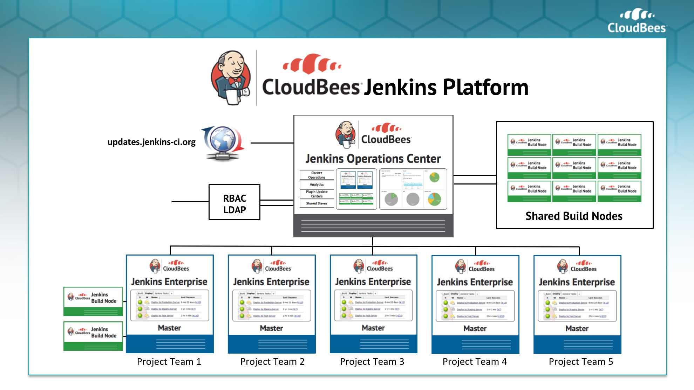
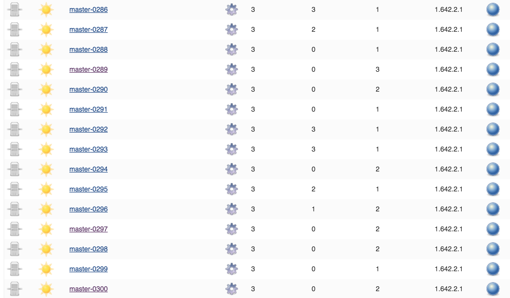
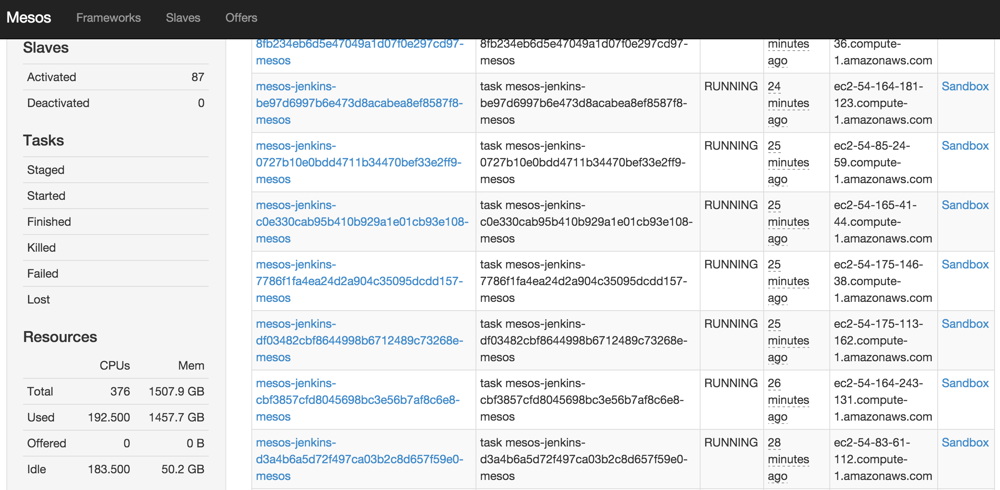
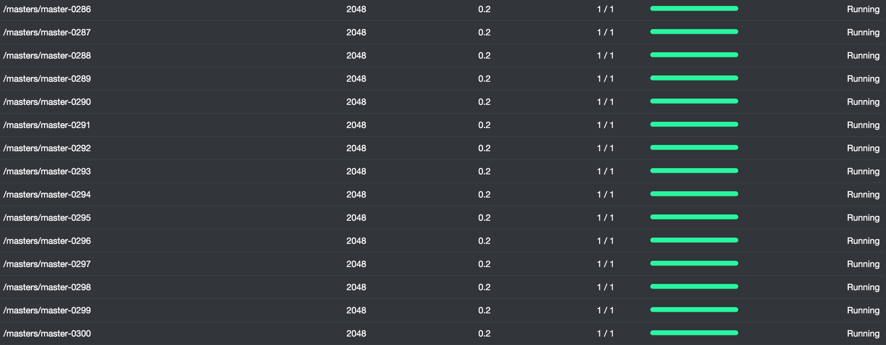
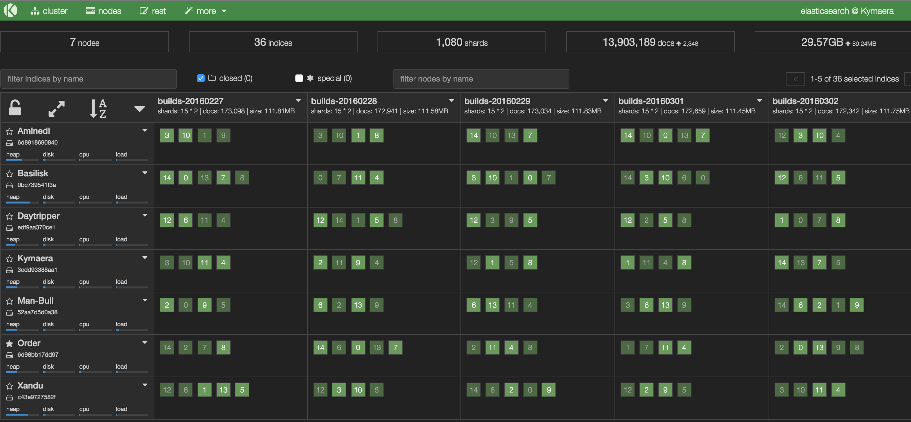

### CI and CD at Scale
## Scaling Jenkins with Docker and Apache Mesos

[Carlos Sanchez](http://csanchez.org)

[csanchez.org](http://csanchez.org) / [@csanchez](http://twitter.com/csanchez)

---

# About me

Senior Software Engineer @ CloudBees

Contributor to the Jenkins Mesos plugin and the Java Marathon client

Author of Jenkins Kubernetes plugin

Long time OSS contributor at Apache, Eclipse, Puppet,…

---

# Our use case

Scaling Jenkins

<small>Your mileage may vary</small>

----

# Scaling Jenkins

Two options:

* More build agents per master
* More masters

----

## Scaling Jenkins: More Build Agents

* Pros

 * Multiple plugins to add more agents, even dynamically

* Cons

 * The master is still a SPOF
 * Handling multiple configurations, plugin versions,...
 * There is a limit on how many build agents can be attached

----

## Scaling Jenkins: More Masters

* Pros

 * Different sub-organizations can self service and operate independently

* Cons

 * Single Sign-On
 * Centralized configuration and operation

----

### [CloudBees Jenkins Enterprise Edition](https://www.cloudbees.com/cloudbees-jenkins-platform-enterprise-edition)

CloudBees Jenkins Operations Center

----

### [CloudBees Jenkins Platform - Private SaaS Edition](https://www.cloudbees.com/products/cloudbees-jenkins-platform/private-saas-edition)

The best of both worlds

CloudBees Jenkins Operations Center with multiple masters

Dynamic build agent creation in each master

ElasticSearch for Jenkins metrics and Logstash

----

## But it is not trivial

<!--

-->

---

# Architecture

Docker Docker Docker

----

Isolated Jenkins masters

Isolated build agents and jobs

Memory and CPU limits

<!--

-->

----

## Embrace failure!

---

# Cluster Scheduling

* Running in public cloud, private cloud, VMs or bare metal
 * Starting with AWS and OpenStack
* HA and fault tolerant
* With Docker support of course

<!--

-->

----

## Apache Mesos

<q>A distributed systems kernel</q>

----

## Alternatives

Docker Swarm / Kubernetes

----

## Mesosphere Marathon

---

<!--

## Terraform

## Terraform

    resource "aws_instance" "worker" {
        count = 1
        instance_type = "m3.large"
        ami = "ami-xxxxxx"
        key_name = "tiger-csanchez"
        security_groups = ["sg-61bc8c18"]
        subnet_id = "subnet-xxxxxx"
        associate_public_ip_address = true
        tags {
            Name = "tiger-csanchez-worker-1"
            "cloudbees:pse:cluster" = "tiger-csanchez"
            "cloudbees:pse:type" = "worker"
        }
        root_block_device {
            volume_size = 50
        }
    }

## Terraform

* State is managed
* Runs are idempotent
 * `terraform apply`
* Sometimes it is too automatic
 * Changing image id will restart all instances

* Preinstall packages: Mesos, Marathon, Docker
* Cached docker images
* Other drivers: XFS, NFS,...
* Enhanced networking driver (AWS)

-->

# Storage

Handling distributed storage

Servers can start in any host of the cluster

And they can move when they are restarted

Jenkins masters need persistent storage, agents (_typically_) don't

Supporting EBS (AWS) and external NFS

----

## Sidekick Container

A privileged container that manages mounting for other containers

Can execute commands in the host and other containers

----

## Sidekick Container _Castle_

<!--
Running in Marathon in each host

    "constraints": [
      [
        "hostname",
        "UNIQUE"
      ]
    ]

-->

A lot of magic happening with `nsenter`

both in host and other containers

<!--

* Jenkins master container requests data on startup using _entrypoint_
 * REST call to Castle
* Castle checks authentication
* Creates necessary storage in the backend
 * EBS volumes from snapshots
 * Directories in NFS backend

* Mounts storage in requesting container
 * EBS is mounted to host, then bind mounted into container
 * NFS is mounted directly in container
* Listens to Docker event stream for killed containers

-->

----

## Castle: backups and cleanup

Periodically takes S3 snapshots from EBS volumes in AWS

Cleanups happening at different stages and periodically

### Embrace failure!

----

## Permissions

Containers should not run as root

Container user id != host user id

i.e. `jenkins` user in container is always 1000 but matches `ubuntu` user in host

<!--

## Caveats

Only a limited number of EBS volumes can be mounted <!-\- .element: class="fragment" -\->

Docs say `/dev/sd[f-p]`, but `/dev/sd[q-z]` seem to work too

Sometimes the device gets corrupt and no more EBS volumes can be mounted there <!-\- .element: class="fragment" -\->

NFS users must be centralized and match in cluster and NFS server <!-\- .element: class="fragment" -\->

-->

---

# Memory

Scheduler needs to account for container memory requirements and host available memory

Prevent containers for using more memory than allowed

Memory constrains translate to Docker [--memory](https://docs.docker.com/engine/reference/run/#runtime-constraints-on-resources)

----

## What do you think happens when?

Your container goes over memory quota?

----

----

## What about the JVM?

----

## What about the child processes?

----

# CPU

Scheduler needs to account for container CPU requirements and host available CPUs

----

## What do you think happens when?

Your container tries to access more than one CPU

Your container goes over CPU limits

----

Totally different from memory

CPU translates into Docker [`--cpu-shares`](https://docs.docker.com/engine/reference/run/#runtime-constraints-on-resources)

<!--

# Other considerations

## Zombie reaping problem

Zombie processes are processes that have terminated but have not (yet) been waited for by their parent processes.

The init process -- PID 1 -- task is to "adopt" orphaned child processes

[source](https://blog.phusion.nl/2015/01/20/docker-and-the-pid-1-zombie-reaping-problem/)

### This is a problem in Docker

Jenkins build agent run multiple processes

But Jenkins masters too, and they are long running

### [`tini`](https://github.com/krallin/tini)

Systemd or SysV init is too heavyweight for containers

> All Tini does is spawn a single child (Tini is meant to be run in a container),
> and wait for it to exit all the while reaping zombies and performing signal forwarding.

### process reaping

Docker 1.9 gave us trouble at scale, rolled back to 1.8

Lots of _defunct_ processes

-->

---

# Networking

Jenkins masters open several ports

* HTTP
* JNLP Build agent
* SSH server (Jenkins CLI type operations)

----

## Networking: HTTP

We use a simple `nginx` reverse proxy for

* Mesos
* Marathon
* ElasticSearch
* CJOC
* Jenkins masters

Gets destination host and port from Marathon

<!--

## Networking: HTTP

Doing both

* domain based routing `master1.pse.example.com`
* path based routing `pse.example.com/master1`
 * because not everybody can touch the DNS or get a wildcard SSL certificate

-->

----

## Networking: JNLP

Build agents started dynamically in Mesos cluster can connect to masters internally

Build agents manually started outside cluster get host and port destination from HTTP, then connect directly 

<!--

## Networking: SSH

SSH Gateway Service

Tunnel SSH requests to the correct host

Simple configuration needed in client

    Host=*.ci.cloudbees.com
    ProxyCommand=ssh -q -p 22 ssh.ci.cloudbees.com tunnel %h

allows to run

    ssh master1.ci.cloudbees.com

-->

<!--

There are more complete solutions like Consul

## Networking: security

Prevent/Allow

| from | to ||
|---|---|---|
| container | host | `iptables` |
| container | container | `--icc=false` + `--link`, `docker0` bridge device tricks |
| container | another host | `--ip-forward=false`, `iptables ` |
| container | container in another host | `iptables` |

## Networking: Software Defined Networks

Create new custom networks on top of physical networks

Allow grouping containers in subnets

Not trivial to setup

## Networking: Software Defined Networks

[Battlefield: Calico, Flannel, Weave and Docker Overlay Network](http://chunqi.li/2015/11/15/Battlefield-Calico-Flannel-Weave-and-Docker-Overlay-Network/)

[http://chunqi.li/2015/11/15/Battlefield-Calico-Flannel-Weave-and-Docker-Overlay-Network/](http://chunqi.li/2015/11/15/Battlefield-Calico-Flannel-Weave-and-Docker-Overlay-Network/)

### Docker Overlay

Docker networking with default `overlay` driver, using VxLAN

    # On the Swarm master
    docker network create --driver overlay --subnet=10.0.9.0/24 my-net

Uses Consul, etcd or ZooKeeper as key-value stores

### Weave

UDP and VxLAN backends

### CoreOS `flannel`

UDP and VxLAN backends

Uses `etcd` for key-value store

### Project Calico

A pure Layer 3 model

### Kubernetes networking

All containers can communicate with all other containers
 without NAT

All nodes can communicate with all containers (and vice-versa) 
without NAT

The IP that a container sees itself as is the same IP
 that others see it as

### Kubernetes networking

Every machine in the cluster is assigned a full subnet

ie. node A 10.0.1.0/24 and node B 10.0.2.0/24

Simpler port mapping

Only supported by GCE or using CoreOS `flannel`
-->

---

# Scaling

New and interesting problems

<iframe width="560" height="315" src="https://www.youtube.com/embed/PivpCKEiQOQ?rel=0&start=15" frameborder="0" allowfullscreen></iframe>

----

<!--

-->

----

## A 300 Jenkins masters cluster

* 3 Mesos masters (m3.xlarge: 4 vCPU, 15GB, 2x40 SSD)
* 80 Mesos slaves (m3.xlarge)
* 7 Mesos slaves dedicated to ElasticSearch: (r3.2xlarge: 8 vCPU, 61GB, 1x160 SSD)

**Total: 1.5TB 376 CPUs**

Running 300 masters and ~3 concurrent jobs per master

Masters: 2GB 0.1 CPU / Build agents: 512MB 0.1 CPU

----

----

----

----

----

----

### Terraform AWS

* Instances
* Keypairs
* Security Groups
* S3 buckets
* ELB
* VPCs

----

### AWS

Resource limits: VPCs, S3 snapshots, some instance sizes <!-- .element: class="fragment" -->

Rate limits: affect the whole account <!-- .element: class="fragment" -->

Retrying is your friend, but with exponential backoff <!-- .element: class="fragment" -->

----

### AWS

Running with a patched Terraform to overcome timeouts and AWS _eventual consistency_

<!--
    13:40:05 [vpc] aws_route_table.public: Still creating... (1m0s elapsed)
    [vpc] * aws_route_table.public: Error waiting for route table (rtb-f954189e) to become available: timeout while waiting for state to become '[ready]'
-->

<pre class="stretch"><code data-trim data-noescape>
&lt;?xml version="1.0" encoding="UTF-8"?>
&lt;DescribeVpcsResponse xmlns="http://ec2.amazonaws.com/doc/2015-10-01/">
  &lt;requestId>8f855bob-3421-4cff-8c36-4b517eb0456c&lt;/requestld>
  &lt;vpcSet>
    &lt;item>
      &lt;vpcId><mark>vpc-30136159</mark>&lt;/vpcId>
      &lt;state>available&lt;/state>
      &lt;cidrBlock>10.16.0.0/16&lt;/cidrBlock>
                              ...
&lt;/DescribeVpcsResponse>
2016/05/18 12:55:57 [DEBUG] [aws-sdk-go] DEBUG: Response ec2/DescribeVpcAttribute Details:
--[ RESPONSE] ------------------------------------
HTTP/1.1 400 Bad Request
&lt;Response>&lt;Errors>&lt;Error>&lt;Code>InvalidVpcID.NotFound&lt;/Code>&lt;Message>
The vpc ID <mark>'vpc-30136159‘</mark> does not
exist&lt;/Message>&lt;/Error>&lt;/Errors>
</code></pre>

----

### Terraform OpenStack

* Instances
* Keypairs
* Security Groups
* Load Balancer
* Networks

----

## OpenStack

Custom flavors

Custom images

Different CLI commands

There are not two OpenStack installations that are the same

<!--

# Upgrades / Maintenance

Moving containers from hosts

Draining hosts

Rolling updates

Blue/Green deployment

Immutable infrastructure
-->

---

# Thanks

[csanchez.org](http://csanchez.org)

 [csanchez](http://twitter.com/csanchez)

 [carlossg](https://github.com/carlossg)

