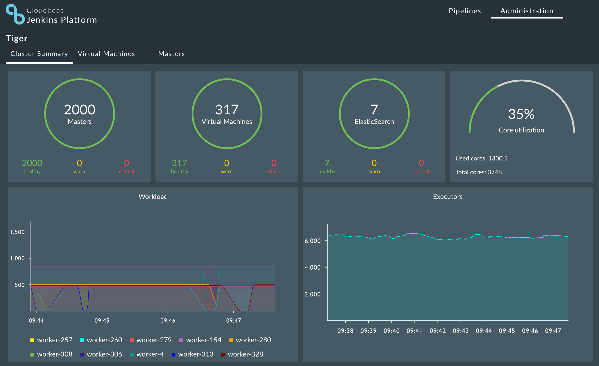
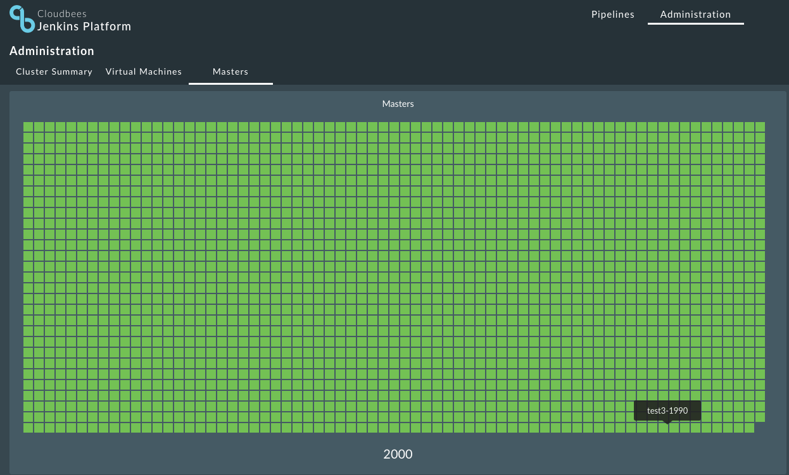
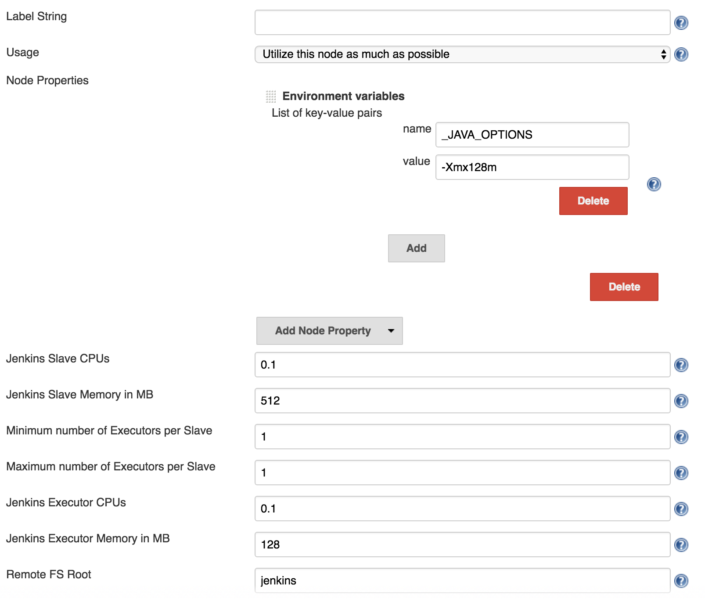

## From Monolith to Docker Distributed Applications

[Carlos Sanchez](http://csanchez.org)

[@csanchez](http://twitter.com/csanchez) [csanchez.org](http://csanchez.org)

 

<small>[Watch online at carlossg.github.io/presentations](https://carlossg.github.io/presentations)</small>

---

# About me

Senior Software Engineer @ CloudBees

Author of Jenkins Kubernetes plugin

Long time OSS contributor at Apache Maven, Eclipse, Puppet,…

---

## Docker Docker Docker

----

<!--
## But it is not trivial

-->

----

# Our use case

Scaling Jenkins

<small>Your mileage may vary</small>

----

----

----

----

----

## A 2000 Jenkins Masters Cluster

* 3 Mesos masters (m3.xlarge: 4 vCPU, 15GB, 2x40 SSD)
* 317 Mesos slaves (c3.2xlarge, m3.xlarge, m4.4xlarge)
* 7 Mesos slaves dedicated to ElasticSearch: (c3.8xlarge: 32 vCPU, 60GB)

**12.5 TB - 3748 CPU**

Running 2000 masters and ~8000 concurrent jobs

---

# Architecture

----

----

Isolated Jenkins masters

Isolated build agents and jobs

Memory and CPU limits

----

----

<!-- 
> How would you design your infrastructure if you couldn't login? Ever.

> Kelsey Hightower
 -->

---

# Cluster Scheduling

Distribute tasks across a cluster of hosts

Running in public cloud, private cloud, VMs or bare metal

HA and fault tolerant

With Docker support of course

<!--

-->

----

## Apache Mesos

<q>A distributed systems kernel</q>

----

## Alternatives

Docker Swarm / Kubernetes

----

## Mesosphere Marathon

----

## Terraform

----

## Terraform

    resource "aws_instance" "worker" {
        count = 1
        instance_type = "m3.large"
        ami = "ami-xxxxxx"
        key_name = "tiger-csanchez"
        security_groups = ["sg-61bc8c18"]
        subnet_id = "subnet-xxxxxx"
        associate_public_ip_address = true
        tags {
            Name = "tiger-csanchez-worker-1"
            "cloudbees:pse:cluster" = "tiger-csanchez"
            "cloudbees:pse:type" = "worker"
        }
        root_block_device {
            volume_size = 50
        }
    }

----

## Terraform

* State is managed
* Runs are idempotent
 * `terraform apply`
* Sometimes it is too automatic
 * Changing image id will restart all instances

----

----

## If you haven't automatically destroyed something by mistake,
## you are not automating enough

<!--

<iframe width="560" height="315" src="https://www.youtube.com/embed/PivpCKEiQOQ?rel=0&start=15" frameborder="0" allowfullscreen></iframe>

-->

---

# Storage

Handling distributed storage

Servers can start in any host of the cluster

And they can move when they are restarted

----

## Docker Volume Plugins

*   Flocker
*   GlusterFS
*   NFS
*   EBS

----

<!-- 

 -->

## Kubernetes

*   GCE disks
*   Flocker
*   GlusterFS
*   NFS
*   EBS

<!--

## Sidekick container

A privileged container that manages mounting for other containers

Can execute commands in the host and other containers

A lot of magic happening with `nsenter`

## In our case

Sidekick container

Jenkins masters need persistent storage, build agents (_typically_) don't

Supporting EBS (AWS) and external NFS

## Castle

* Jenkins master container requests data on startup using _entrypoint_
 * REST call to Castle
* Castle checks authentication
* Creates necessary storage in the backend
 * EBS volumes from snapshots
 * Directories in NFS backend

## Castle

* Mounts storage in requesting container
 * EBS is mounted to host, then bind mounted into container
 * NFS is mounted directly in container
* Listens to Docker event stream for killed containers

## Castle: backups and cleanup

Periodically takes S3 snapshots from EBS volumes in AWS

Cleanups happening at different stages and periodically

### Embrace failure!

-->

----

## Permissions

Containers should not run as root

Container user id != host user id

i.e. `jenkins` user in container is always 1000 but matches `ubuntu` user in host

<!--

## Caveats

Only a limited number of EBS volumes can be mounted <!-\- .element: class="fragment" -\->

Docs say `/dev/sd[f-p]`, but `/dev/sd[q-z]` seem to work too

Sometimes the device gets corrupt and no more EBS volumes can be mounted there <!-\- .element: class="fragment" -\->

NFS users must be centralized and match in cluster and NFS server <!-\- .element: class="fragment" -\->

-->

---

# Memory

Scheduler needs to account for container memory requirements and host available memory

Prevent containers for using more memory than allowed

Memory constrains translate to Docker [--memory](https://docs.docker.com/engine/reference/run/#runtime-constraints-on-resources)

----

## What do you think happens when?

Your container goes over memory quota?

----

----

## What about the JVM?

## What about the child processes?

---

# CPU

Scheduler needs to account for container CPU requirements and host available CPUs

----

## What do you think happens when?

Your container tries to access more than one CPU

Your container goes over CPU limits

----

Totally different from memory

Mesos/Kubernetes CPU translates into Docker [`--cpu-shares`](https://docs.docker.com/engine/reference/run/#runtime-constraints-on-resources)

---

# Networking

Multiple services running in the same ports

Must redirect from random ports in the host

Services running in one host need to access services in other hosts

<!-- 
## Networking: Service discovery

DNS is not great, caching can happen at multiple levels

`marathon-lb` uses `haproxy` and Marathon API

A typical `nginx` reverse proxy is also easy to setup
 -->

----

## Networking: Software Defined Networks

Create new custom networks on top of physical networks

Allow grouping containers in subnets

----

## Networking: Software Defined Networks

[Battlefield: Calico, Flannel, Weave and Docker Overlay Network](http://chunqi.li/2015/11/15/Battlefield-Calico-Flannel-Weave-and-Docker-Overlay-Network/)

[http://chunqi.li/2015/11/15/Battlefield-Calico-Flannel-Weave-and-Docker-Overlay-Network/](http://chunqi.li/2015/11/15/Battlefield-Calico-Flannel-Weave-and-Docker-Overlay-Network/)

<!--

### Docker Overlay

Docker networking with default `overlay` driver, using VxLAN

    # On the Swarm master
    docker network create -\-driver overlay -\-subnet=10.0.9.0/24 my-net

Uses Consul, etcd or ZooKeeper as key-value stores

### Weave

UDP and VxLAN backends

### CoreOS `flannel`

UDP and VxLAN backends

Uses `etcd` for key-value store

### Project Calico

A pure Layer 3 model

### Kubernetes networking

All containers can communicate with all other containers
 without NAT

All nodes can communicate with all containers (and vice-versa) 
without NAT

The IP that a container sees itself as is the same IP
 that others see it as

### Kubernetes networking

Every machine in the cluster is assigned a full subnet

ie. node A 10.0.1.0/24 and node B 10.0.2.0/24

Simpler port mapping

Only supported by GCE or using CoreOS `flannel`
-->

---

# Scaling

New and interesting problems

----

<!--
## Logging 

Running ElasticSearch as a cluster service, and the ELK stack

Docker configured to log to syslog

Logstash redirecting syslog to ElasticSearch

Embedded Kibana dashboard in CloudBees Jenkins Operations Center
-->

## AWS

Resource limits: VPCs, S3 snapshots, some instance sizes <!-- .element: class="fragment" -->

Rate limits: affect the whole account <!-- .element: class="fragment" -->

Retrying is your friend, but with exponential backoff <!-- .element: class="fragment" -->

----

## Embrace failure!

<!--
## OpenStack

Custom flavors

Custom images

Different CLI commands

There are not two OpenStack installations that are the same

# Upgrades / Maintenance

Moving containers from hosts

Draining hosts

Rolling updates

Blue/Green deployment

Immutable infrastructure

-->

---

# Jenkins Plugins

---

## Jenkins Docker Plugins

* Dynamic Jenkins agents with Docker plugin or Yet Another Docker Plugin
  * No support yet for Docker 1.12 Swarm mode
* Agent image needs to include Java, downloads slave jar from Jenkins master
* Multiple plugins for different tasks
  * Docker build and publish
  * Docker build step plugin
  * CloudBees Docker Hub/Registry Notification
  * CloudBees Docker Traceability
* Great pipeline support

----

----

----

### Jenkins Docker Pipeline

    def maven = docker.image('maven:3.3.9-jdk-8');

    stage 'Mirror'
    maven.pull()
    docker.withRegistry('https://secure-registry/', 'docker-registry-login') {

      stage 'Build'
      maven.inside {
        sh "mvn -B clean package"
      }
      
      stage 'Bake Docker image'
      def pcImg = docker.build("examplecorp/spring-petclinic:${env.BUILD_TAG}", 'app')

      pcImg.push();
    }

---

## Jenkins Mesos Plugin

* Dynamic Jenkins agents, both Docker and isolated processes
* Agent image needs to include Java, grabs slave jar from Mesos sandbox
* Can run Docker commands on the host, outside of Mesos

----

----

----

----

## Jenkins Mesos Plugin

Can use Docker pipelines with some tricks

* Need Docker client installed
* Shared docker.sock from host
* Mount the workspace in the host, visible under same dir

----

### Mesos Plugin and Pipeline

    node('docker') {
        docker.image('golang:1.6').inside {

            stage 'Get sources'
            git url: 'https://github.com/hashicorp/terraform.git', tag: "v0.6.15"

            stage 'Build'
            sh """#!/bin/bash -e
            mkdir -p /go/src/github.com/hashicorp
            ln -s `pwd` /go/src/github.com/hashicorp/terraform
            pushd /go/src/github.com/hashicorp/terraform
            make core-dev plugin-dev PLUGIN=provider-aws
            popd
            cp /go/bin/terraform-provider-aws .
            """

            stage 'Archive'
            archive "terraform-provider-aws"
        }
    }

---

## [Jenkins Kubernetes Plugin](https://wiki.jenkins-ci.org/display/JENKINS/Kubernetes+Plugin)

* Dynamic Jenkins agents, running as Pods
* Multiple container support
  * One jnlp image, others custom
* Pipeline support for both agent Pod definition and execution will be in next version

----

### Jenkins Kubernetes Pipeline

    podTemplate(label: 'mypod', containers: [
            [name: 'jnlp', image: 'jenkinsci/jnlp-slave:alpine', args: '${computer.jnlpmac} ${computer.name}'],
            [name: 'maven', image: 'maven:3-jdk-8', ttyEnabled: true, command: 'cat'],
            [name: 'golang', image: 'golang:1.6', ttyEnabled: true, command: 'cat'],
        ]) {

        node ('mypod') {
            stage 'Get a Maven project'
            git 'https://github.com/jenkinsci/kubernetes-plugin.git'
            container('maven') {
                stage 'Build a Maven project'
                sh 'mvn clean install'
            }

            stage 'Get a Golang project'
            git url: 'https://github.com/hashicorp/terraform.git'
            container('golang') {
                stage 'Build a Go project'
                sh """
                mkdir -p /go/src/github.com/hashicorp
                ln -s `pwd` /go/src/github.com/hashicorp/terraform
                cd /go/src/github.com/hashicorp/terraform && make core-dev
                """
            }
        }
    }

----

## Jenkins Plugins Recap

* Dynamic Jenkins agent creation
* Using JNLP slave jar
  * In complex environments need to use the `tunnel` option to connect internally
* Using the Cloud API
 * Not ideal for containerized workload
 * Agents take > 1 min to start provision and are kept around
 * Agents can provide more than one executor

---

# спасибо

[csanchez.org](http://csanchez.org)

 [csanchez](http://twitter.com/csanchez)

 [carlossg](https://github.com/carlossg)

 
