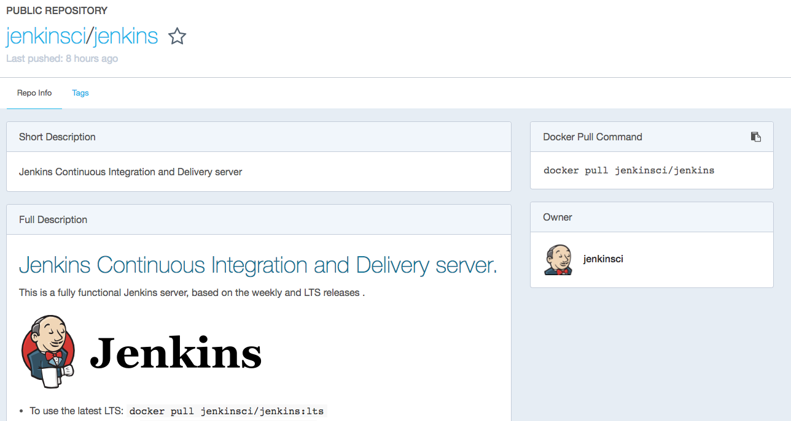

### Using Kubernetes for
## Continuous Integration
##### and
## Continuous Delivery

[Carlos Sanchez](http://csanchez.org)

[csanchez.org](http://csanchez.org) / [@csanchez](http://twitter.com/csanchez)

<a href="http://cloudbees.com"></a>

<small>[Watch online at carlossg.github.io/presentations](https://carlossg.github.io/presentations)</small>

---


# About me

Engineer @ CloudBees, Scaling Jenkins

Author of Jenkins Kubernetes plugin

Contributor to Jenkins and Maven official Docker images

Long time OSS contributor at Apache Maven, Eclipse, Puppet,…


---


----

<!--
## Using Containers is not Trivial


-->

## When One Machine is no Longer Enough

* Running containers across multiple hosts
* Multiple environments: public cloud, private cloud, VMs or bare metal
* HA and fault tolerance

----

> How would you design your infrastructure if you couldn't login? Ever.

> Kelsey Hightower

----


<!--


# 

<q>A distributed systems kernel</q>


 -->

<!--
# Apache Mesos

* Started before 2011
* Runs tasks, any binary or Docker, `rkt`, `appc` images
* Frameworks run on top of Mesos
 * Mesosphere Marathon: long running services
 * Apache Aurora: long running services
 * Chronos: distributed cron-like system
* Used in Twitter, Airbnb, eBay, Apple, Verizon, Yelp,...
 -->

<!--
# Docker Swarm


* No need to install extra software
* Each daemon can run as a Swarm member
* New `service` object to describe distributed containers
 * Existing tooling needs to be updated

 -->

---


# 

----

# Kubernetes

* Based on Google Borg
* Run in local machine, virtual, cloud
* Google provides Google Container Engine (GKE)
* Other services run by stackpoint.io, CoreOS Tectonic, Azure,...
* Minikube for local testing

----

# Kubernetes

Free goodies:

* Declarative Syntax
* Pods (groups of colocated containers)
* Persistent Storage
* Networking Isolation

----


----


----


----


----

> If you haven't automatically destroyed something by mistake, you are not automating enough

---


<!--
# Scaling Jenkins

Two options:

* More build agents per master
* More masters


## Scaling Jenkins: More Build Agents

* Pros

 * Multiple plugins to add more agents, even dynamically

* Cons

 * The master is still a SPOF
 * Handling multiple configurations, plugin versions,...
 * There is a limit on how many build agents can be attached


## Scaling Jenkins: More Masters

* Pros

 * Different sub-organizations can self service and operate independently

* Cons

 * Single Sign-On
 * Centralized configuration and operation

Covered by CloudBees Jenkins Enterprise

-->


<!--

# Docker and Jenkins


# Running in Docker




## Jenkins Docker Plugins

* Dynamic Jenkins agents with Docker plugin or Yet Another Docker Plugin
  * No support yet for Docker Swarm mode
* Isolated build agents and jobs
* Agent image needs to include Java, downloads slave jar from Jenkins master


## Jenkins Docker Plugins

* Multiple plugins for different tasks
  * Docker build and publish
  * Docker build step plugin
  * CloudBees Docker Hub/Registry Notification
  * CloudBees Docker Traceability
* Great pipeline support

-->

<!--  -->


<!--  -->


<!--

### Jenkins Docker Pipeline

    def maven = docker.image('maven:3.3.9-jdk-8');

    stage('Mirror') {
      maven.pull()
    }

    docker.withRegistry('https://secure-registry/',
      'docker-registry-login') {

      stage('Build') {
        maven.inside {
          sh "mvn -B clean package"
        }
      }

      stage('Bake Docker image') {
        def pcImg = docker.build(
          "examplecorp/spring-petclinic:${env.BUILD_TAG}", 'app')

        pcImg.push();
      }
    }
-->

<!-- ### [Jenkins Docker Slaves Plugin](https://wiki.jenkins-ci.org/display/JENKINS/Docker+Slaves+Plugin)

Use any Docker image, no need for Java

Definition in pipeline

Can have side containers


    dockerNode("maven:3.3.3-jdk-8") {
      sh "mvn -version"
    }

 -->


#   &  

----

We can run both Jenkins **masters and agents** in Kubernetes

----

## Infinite Scale!

[Jenkins Kubernetes Plugin](https://wiki.jenkins-ci.org/display/JENKINS/Kubernetes+Plugin)

* Dynamic Jenkins agents, running as Pods
* Multi-container support
  * One Jenkins agent image, others custom
* Pipeline support for both agent Pod definition and execution
* Persistent workspace

----

## On Demand Jenkins Agents

```groovy
podTemplate(label: 'mypod') {
  node('mypod') {
    sh 'Hello world!'
  }
}
```

----

## Grouping Containers (Pods)

```groovy
podTemplate(label: 'maven', containers: [
  containerTemplate(name: 'maven', image: 'maven:3.3.9-jdk-8-alpine',
    ttyEnabled: true, command: 'cat') ]) {

  node('maven') {
    stage('Get a Maven project') {
      git 'https://github.com/jenkinsci/kubernetes-plugin.git'
      container('maven') {
        stage('Build a Maven project') {
          sh 'mvn -B clean package'
        }
      }
    }
  }
}
```

----

## Using Declarative Pipeline Too

```groovy
pipeline {
  agent {
    kubernetes {
      label 'mypod'
      containerTemplate {
        name 'maven'
        image 'maven:3.3.9-jdk-8-alpine'
        ttyEnabled true
        command 'cat'
      }
    }
  }
  stages {
    stage('Run maven') {
      steps {
        container('maven') {
          sh 'mvn -version'
        }
      }
    }
  }
}
```

----

## Pods: Multi-language Pipeline

```groovy
podTemplate(label: 'maven-golang', containers: [
  containerTemplate(name: 'maven', image: 'maven:3.3.9-jdk-8-alpine',
    ttyEnabled: true, command: 'cat'),
  containerTemplate(name: 'golang', image: 'golang:1.8.0',
    ttyEnabled: true, command: 'cat')]) {

  node('maven-golang') {
    stage('Build a Maven project') {
      git 'https://github.com/jenkinsci/kubernetes-plugin.git'
      container('maven') {
        sh 'mvn -B clean package'
      }
    }

    stage('Build a Golang project') {
      git url: 'https://github.com/hashicorp/terraform.git'
      container('golang') {
        sh """
        mkdir -p /go/src/github.com/hashicorp
        ln -s `pwd` /go/src/github.com/hashicorp/terraform
        cd /go/src/github.com/hashicorp/terraform && make core-dev
        """
      }
    }
  }
}
```

----

## Pods: Selenium

Example:

* Jenkins agent
* Maven build
* Selenium Hub with
  * Firefox
  * Chrome

5 containers

----

```groovy
podTemplate(label: 'maven-selenium', containers: [
  containerTemplate(name:'maven-firefox',image:'maven:3.3.9-jdk-8-alpine',
    ttyEnabled: true, command: 'cat'),
  containerTemplate(name:'maven-chrome',image:'maven:3.3.9-jdk-8-alpine',
    ttyEnabled: true, command: 'cat'),
  containerTemplate(name: 'selenium-hub', image: 'selenium/hub:3.4.0'),
  // because containers run in the same network space, we need to
  // make sure there are no port conflicts
  // we also need to adapt the selenium images because they were
  // designed to work with the --link option
  containerTemplate(name: 'selenium-chrome',
    image: 'selenium/node-chrome:3.4.0', envVars: [
    containerEnvVar(key: 'HUB_PORT_4444_TCP_ADDR', value: 'localhost'),
    containerEnvVar(key: 'HUB_PORT_4444_TCP_PORT', value: '4444'),
    containerEnvVar(key: 'DISPLAY', value: ':99.0'),
    containerEnvVar(key: 'SE_OPTS', value: '-port 5556'),
  ]),
  containerTemplate(name: 'selenium-firefox',
    image: 'selenium/node-firefox:3.4.0', envVars: [
    containerEnvVar(key: 'HUB_PORT_4444_TCP_ADDR', value: 'localhost'),
    containerEnvVar(key: 'HUB_PORT_4444_TCP_PORT', value: '4444'),
    containerEnvVar(key: 'DISPLAY', value: ':98.0'),
    containerEnvVar(key: 'SE_OPTS', value: '-port 5557'),
  ])
  ]) {
```

----

```groovy
  node('maven-selenium') {
    stage('Checkout') {
      git 'https://github.com/carlossg/selenium-example.git'
      parallel (
        firefox: {
          container('maven-firefox') {
            stage('Test firefox') {
              sh """
              mvn -B clean test -Dselenium.browser=firefox \
                -Dsurefire.rerunFailingTestsCount=5 -Dsleep=0
              """
            }
          }
        },
        chrome: {
          container('maven-chrome') {
            stage('Test chrome') {
              sh """
              mvn -B clean test -Dselenium.browser=chrome \
                -Dsurefire.rerunFailingTestsCount=5 -Dsleep=0
              """
            }
          }
        }
      )
    }
  }
}
```

----

## Storage

[Persistent volumes](http://kubernetes.io/docs/user-guide/persistent-volumes/walkthrough/)

*   GCE disks
*   GlusterFS
*   NFS
*   EBS
*   etc

----

## Using persistent volumes

```
apiVersion: "v1"
kind: "PersistentVolumeClaim"
metadata:
  name: "maven-repo"
  namespace: "kubernetes-plugin"
spec:
  accessModes:
    - ReadWriteOnce
  resources:
    requests:
      storage: 10Gi
```

----

```groovy
podTemplate(label: 'maven', containers: [
  containerTemplate(name: 'maven', image: 'maven:3.3.9-jdk-8-alpine',
    ttyEnabled: true, command: 'cat')
  ], volumes: [
  persistentVolumeClaim(mountPath: '/root/.m2/repository',
    claimName: 'maven-repo', readOnly: false)
  ]) {

  node('maven') {
    stage('Build a Maven project') {
      git 'https://github.com/jenkinsci/kubernetes-plugin.git'
      container('maven') {
          sh 'mvn -B clean package'
      }
    }
  }
}
```


<!--

### Permissions

Containers should not run as root

Container user id != host user id

i.e. `jenkins` user in container is always 1000 but matches `ubuntu` user in host


### Permissions

    containers: [...]
    securityContext:
      fsGroup: 1000
    volumes: [...]

> Volumes which support ownership management are modified to be owned and writable by the GID specified in fsGroup


# Networking

Jenkins masters open several ports

* HTTP
* Remoting protocol (agents)

Jenkins agents connect to master:

* inbound (SSH)
* outbound (remoting)


Multiple [networking options](http://kubernetes.io/docs/admin/networking/):

GCE, Flannel, Weave, Calico,...

One IP per Pod

Containers can find other containers in the same Pod using `localhost`

-->

----

## Memory limits

Scheduler needs to account for container memory requirements and host available memory

Prevent containers for using more memory than allowed

Memory constraints translate to Docker [--memory](https://docs.docker.com/engine/reference/run/#user-memory-constraints)

<small>[https://kubernetes.io/docs/concepts/configuration/manage-compute-resources-container/#how-pods-with-resource-limits-are-run](https://kubernetes.io/docs/concepts/configuration/manage-compute-resources-container/#how-pods-with-resource-limits-are-run)</small>

----

### What do you think happens when?

Your container goes over memory quota?

----


----

### New JVM Support for Containers

JDK 8u131+ and JDK 9

```
$ docker run -m 1GB openjdk:8u131 java \
  -XX:+UnlockExperimentalVMOptions \
  -XX:+UseCGroupMemoryLimitForHeap \
  -XshowSettings:vm -version
VM settings:
    Max. Heap Size (Estimated): 228.00M
    Ergonomics Machine Class: server
    Using VM: OpenJDK 64-Bit Server VM
```

[Running a JVM in a Container Without Getting Killed](https://blog.csanchez.org/2017/05/31/running-a-jvm-in-a-container-without-getting-killed)
<small>[https://blog.csanchez.org/2017/05/31/running-a-jvm-in-a-container-without-getting-killed](https://blog.csanchez.org/2017/05/31/running-a-jvm-in-a-container-without-getting-killed)</small>

----

### New JVM Support for Containers

```
$ docker run -m 1GB openjdk:8u131 java \
  -XX:+UnlockExperimentalVMOptions \
  -XX:+UseCGroupMemoryLimitForHeap \
  -XX:MaxRAMFraction=1 -XshowSettings:vm -version
VM settings:
    Max. Heap Size (Estimated): 910.50M
    Ergonomics Machine Class: server
    Using VM: OpenJDK 64-Bit Server VM
```

[Running a JVM in a Container Without Getting Killed](https://blog.csanchez.org/2017/05/31/running-a-jvm-in-a-container-without-getting-killed)
<small>[https://blog.csanchez.org/2017/05/31/running-a-jvm-in-a-container-without-getting-killed](https://blog.csanchez.org/2017/05/31/running-a-jvm-in-a-container-without-getting-killed)</small>

----

## CPU limits

Scheduler needs to account for container CPU requirements and host available CPUs

CPU requests translates into Docker [`--cpu-shares`](https://docs.docker.com/engine/reference/run/#cpu-share-constraint)

CPU limits translates into Docker [`--cpu-quota`](https://docs.docker.com/engine/reference/run/#cpu-quota-constraint)

<small>[https://kubernetes.io/docs/concepts/configuration/manage-compute-resources-container/#how-pods-with-resource-limits-are-run](https://kubernetes.io/docs/concepts/configuration/manage-compute-resources-container/#how-pods-with-resource-limits-are-run)</small>


----

### What do you think happens when?

Your container tries to access more than one CPU

Your container goes over CPU limits

----


Totally different from memory

----

## Resource Requests and Limits

```groovy
podTemplate(label: 'mypod', containers: [
    containerTemplate(
        name: 'maven', image: 'maven', ttyEnabled: true,
        resourceRequestCpu: '50m',
        resourceLimitCpu: '100m',
        resourceRequestMemory: '100Mi',
        resourceLimitMemory: '200Mi')]) {
...
}
```

---


# Deploying to Kubernetes

----

## Deploying to Kubernetes

```groovy
podTemplate(label: 'deployer', serviceAccount: 'deployer', containers: [
    containerTemplate(name: 'kubectl', image: 'lachlanevenson/k8s-kubectl:v1.7.8',
      command: 'cat', ttyEnabled: true)
]){
  node('deployer') {
    container('kubectl') {
      sh "kubectl apply -f my-kubernetes.yaml"
    }
  }
}
```

----

## Deploying to Kubernetes

[kubernetes-pipeline-plugin](https://github.com/jenkinsci/kubernetes-pipeline-plugin)

```groovy
podTemplate(label: 'deploy', serviceAccount: 'deployer') {

  stage('deployment') {
    node('deploy') {
      checkout scm
      kubernetesApply(environment: 'hello-world',
        file: readFile('kubernetes-hello-world-service.yaml'))
      kubernetesApply(environment: 'hello-world',
        file: readFile('kubernetes-hello-world-v1.yaml'))
    }}

  stage('upgrade') {
    timeout(time:1, unit:'DAYS') {
      input id: 'approve', message:'Approve upgrade?'
    }
    node('deploy') {
      checkout scm
      kubernetesApply(environment: 'hello-world',
        file: readFile('kubernetes-hello-world-v2.yaml'))
    }}
}
```

----

Or Azure [kubernetes-cd-plugin](https://github.com/jenkinsci/kubernetes-cd-plugin)

```groovy
kubernetesDeploy(
  credentialsType: 'KubeConfig',
  kubeConfig: [path: '$HOME/.kube/config'],

  configs: '*.yaml',
  enableConfigSubstitution: false,
)
```

<!--

## Jenkins Plugins Caveats

* Using the Cloud API
 * Not ideal for containerized workload
 * Agents can provide more than one executor
 * Agents could take > 1 min to start provision and kept around.
  * Just use

```
 -Dhudson.slaves.NodeProvisioner.MARGIN=50
 -Dhudson.slaves.NodeProvisioner.MARGIN0=0.85
```


## Jenkins Plugins Caveats

* One Shot Executor
 * Improved API to handle one off agents
 * Optimized for containerized agents
 * Plugins need to support it

-->

---


# Благодаря

[csanchez.org](http://csanchez.org)

 [csanchez](http://twitter.com/csanchez)

 [carlossg](https://github.com/carlossg)

[](http://cloudbees.com)
