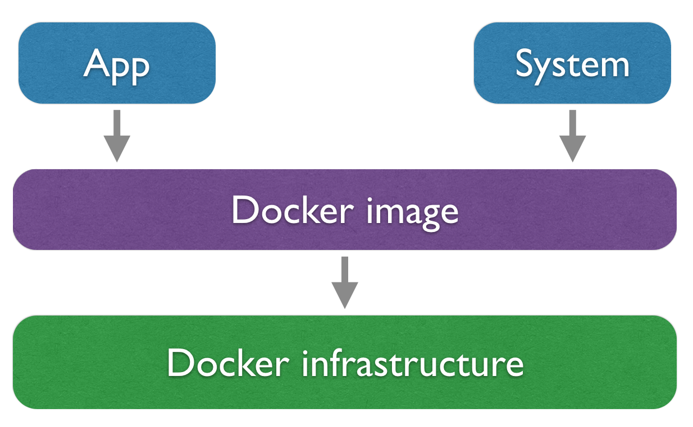
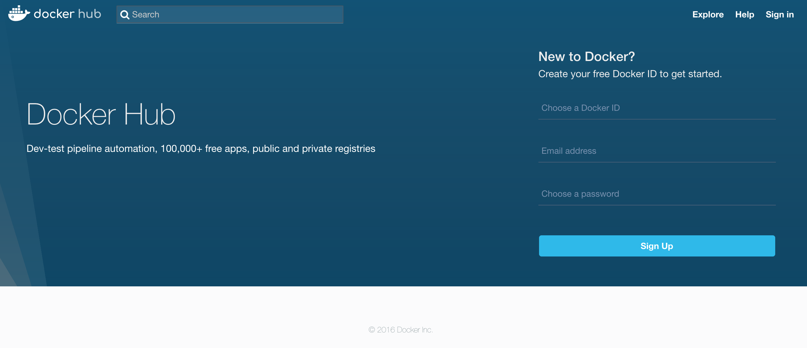
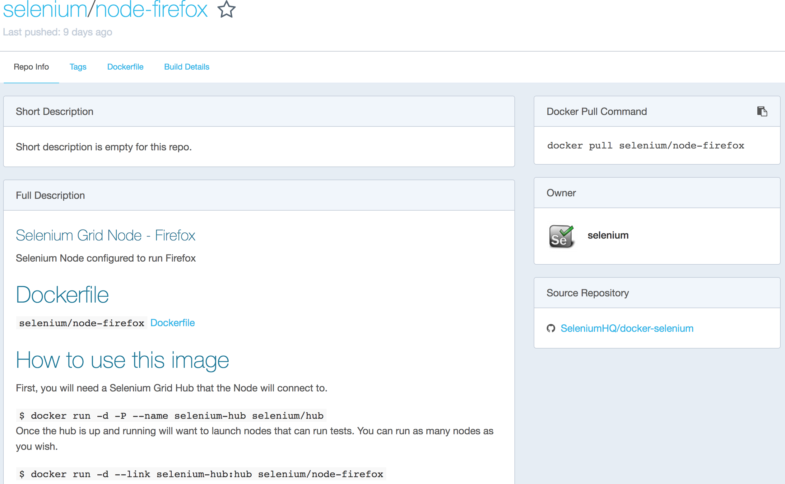
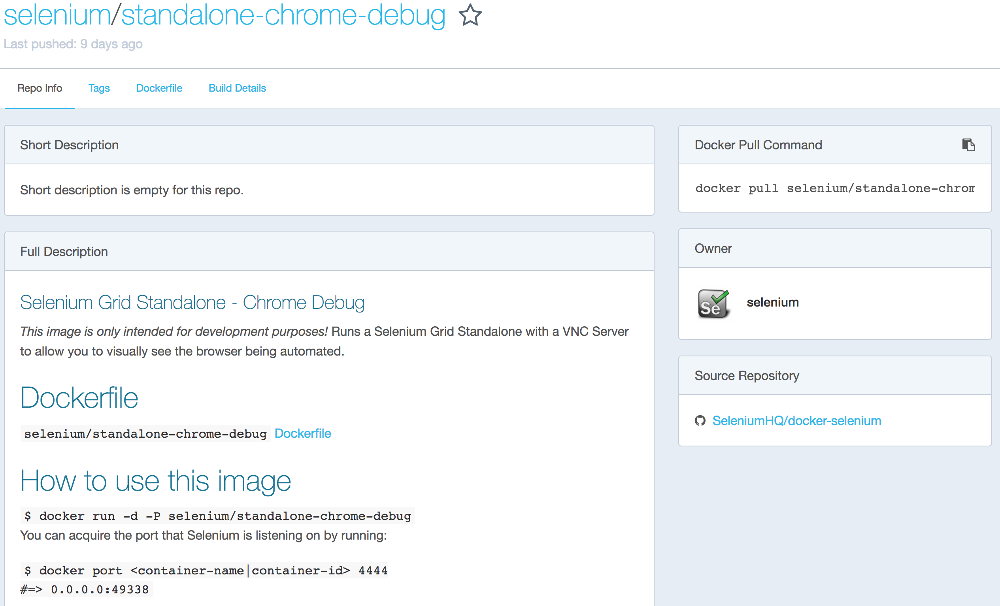

## Jenkins and Containers
### A Match Made in Heaven


[Carlos Sanchez](http://csanchez.org)

[csanchez.org](http://csanchez.org) / [@csanchez](http://twitter.com/csanchez)

<a href="http://cloudbees.com"></a>

<!-- <small>[Watch online at carlossg.github.io/presentations](https://carlossg.github.io/presentations)</small>
 -->

---


# About me

Engineer @ CloudBees, Scaling Jenkins

Author of Jenkins Kubernetes plugin

Contributor to Jenkins and Maven official Docker images

Long time OSS contributor at Apache Maven, Eclipse, Puppet,…


---


----

# Containers

* Linux containers
* File System
* Users
* Processes
* Network


----

> EVERYTHING at Google runs in a container

> Starts over two billion containers per week

----


# Docker Docker Docker


----

## But it is not trivial


<!--

-->

----


## Operating Systems
### Engine Support

The Engine runs the containers

* Linux
* Windows

----

## Operating Systems
### Client Support

The client talks to the engine through an API

* Linux
* OS X
* Windows

----

## Build once
## run anywhere

Bare metal

Virtual Machines

Cloud

----

# Developer Oriented

Dependency hell

Installation nightmares

_"it ran on my machine"_

----

# Ops Oriented

No need to know internals of apps

Focus on OPs problems (scale, monitoring,…)

Clearer deliverables from dev

----



----


----




---


# Related Projects

----

# Docker Machine

Provision Docker engines in virtual machines

* Amazon EC2
* Microsoft Azure
* Google Compute Engine
* OpenStack
* Rackspace
* VMware

----

# Docker Compose

Define multi container applications

```yaml
version: '3'
services:
  web:
    build: .
    ports:
    - "5000:5000"
    volumes:
    - .:/code
    - logvolume01:/var/log
    links:
    - redis
  redis:
    image: redis
volumes:
  logvolume01: {}
```


----

# Orchestrators


---


# Jenkins Plugins

---

## Jenkins Docker Plugins

* Dynamic Jenkins agents with Docker plugin or Yet Another Docker Plugin
  * No support yet for Docker 1.12 Swarm mode
* Agent image needs to include Java, downloads slave jar from Jenkins master
* Multiple plugins for different tasks
  * Docker build and publish
  * Docker build step plugin
  * CloudBees Docker Hub/Registry Notification
  * CloudBees Docker Traceability
* Great pipeline support

----


----


----


### Jenkins Docker Pipeline

    def maven = docker.image('maven:3.3.9-jdk-8');

    stage 'Mirror'
    maven.pull()
    docker.withRegistry('https://secure-registry/', 'docker-registry-login') {

      stage 'Build'
      maven.inside {
        sh "mvn -B clean package"
      }

      stage 'Bake Docker image'
      def pcImg = docker.build("examplecorp/spring-petclinic:${env.BUILD_TAG}", 'app')

      pcImg.push();
    }


---

## [Jenkins Kubernetes Plugin](https://wiki.jenkins-ci.org/display/JENKINS/Kubernetes+Plugin)

* Dynamic Jenkins agents, running as Pods
* Multiple container support
  * One jnlp image, others custom
* Pipeline support for both agent Pod definition and execution
* Persistent workspace in the next version

----

### Jenkins Kubernetes Pipeline

    podTemplate(label: 'mypod', containers: [
            [name: 'maven', image: 'maven:3-jdk-8', ttyEnabled: true, command: 'cat'],
            [name: 'golang', image: 'golang:1.6', ttyEnabled: true, command: 'cat'],
        ]) {

        node ('mypod') {
            stage 'Get a Maven project'
            git 'https://github.com/jenkinsci/kubernetes-plugin.git'
            container('maven') {
                stage 'Build a Maven project'
                sh 'mvn clean install'
            }

            stage 'Get a Golang project'
            git url: 'https://github.com/hashicorp/terraform.git'
            container('golang') {
                stage 'Build a Go project'
                sh """
                mkdir -p /go/src/github.com/hashicorp
                ln -s `pwd` /go/src/github.com/hashicorp/terraform
                cd /go/src/github.com/hashicorp/terraform && make core-dev
                """
            }
        }
    }

----

## Jenkins Plugins Recap

* Dynamic Jenkins agent creation
* Using JNLP slave jar
  * In complex environments need to use the `tunnel` option to connect internally
* Using the Cloud API
 * Not ideal for containerized workload
 * Agents take > 1 min to start provision and are kept around
 * Agents can provide more than one executor

---


# Docker and Selenium

----

Manage multiple combinations of browsers

Any number of them

Standalone or Selenium Hub
  even with VNC

----



----



----

# Selenium Hub

```yaml
docker run -d -p 4444:4444 --name selenium-hub selenium/hub:3.4.0
docker run -d -p 5901:5900 --link selenium-hub:hub \
    selenium/node-chrome-debug:3.4.0
docker run -d -p 5902:5900 --link selenium-hub:hub \
    selenium/node-firefox-debug:3.4.0
```


---


# Danke Schön

[csanchez.org](http://csanchez.org)

 [csanchez](http://twitter.com/csanchez)

 [carlossg](https://github.com/carlossg)
