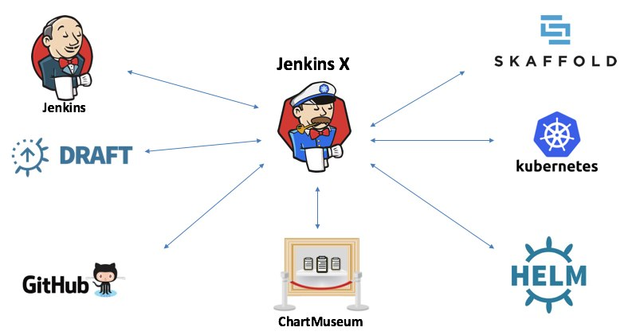

## Jenkins X: Continuous Delivery for Kubernetes

Carlos Sanchez

[csanchez.org](http://csanchez.org)

[@csanchez](http://twitter.com/csanchez)

<!-- <small>[Watch online at carlossg.github.io/presentations](https://carlossg.github.io/presentations)</small> -->

---

# About me

Principal Software Engineer @ CloudBees

Author of Jenkins Kubernetes plugin

Long time OSS contributor at Apache Maven, Eclipse, Puppet,…

---

---

[csanchez.org](http://csanchez.org)

 [csanchez](http://twitter.com/csanchez)&nbsp;
 [carlossg](https://github.com/carlossg)

