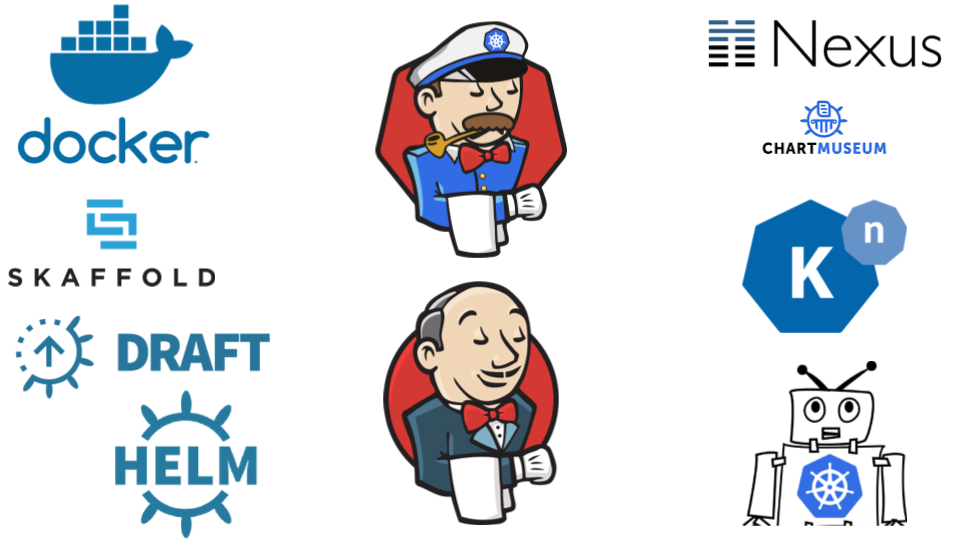

<style>
.container{
    display: flex;
}
.col{
    flex: 1;
}
</style>

<a href="http://jenkins-x.io"> </a>

### Progressive Delivery in Kubernetes with Jenkins X

Carlos Sanchez

[csanchez.org](http://csanchez.org) / 
[@csanchez](http://twitter.com/csanchez)

<a href="http://cloudbees.com"></a>

<!-- <small>[Watch online at carlossg.github.io/presentations](https://carlossg.github.io/presentations)</small> -->

---



---


# Progressive Delivery

----

> [Progressive Delivery](https://redmonk.com/jgovernor/2018/08/06/towards-progressive-delivery/) is the next step after Continuous Delivery
where new versions are deployed to a subset of users and are evaluated in terms of correctness and performance before rolling them to the totality of the users and rolled back if not matching some key metrics.

----

Continuous Delivery is hard

Progressive Delivery makes Continuous Delivery easier to adopt


---

# Progressive Delivery with Jenkins X

----

Install Istio, Prometheus and [Flagger](https://docs.flagger.app)

    jx create addon istio
    jx create addon prometheus
    jx create addon flagger

----


----

## Flagger

[flagger.app](https://flagger.app)

> automates the promotion of canary deployments by using Istio’s traffic shifting and Prometheus metrics to analyse the application’s behaviour during a controlled rollout

----

Get the ip of the Istio ingress and point your wildcard domain to it

    kubectl -n istio-system get service istio-ingressgateway \
      -o jsonpath='{.status.loadBalancer.ingress[0].ip}'

----

Add the [canary object](../charts/croc-hunter-jenkinsx/templates/canary.yaml) that will add our deployment to Flagger

```yaml
{{- if eq .Release.Namespace "jx-production" }}
{{- if .Values.canary.enable }}
apiVersion: flagger.app/v1alpha2
kind: Canary
metadata:
  name: {{ template "fullname" . }}
spec:
  targetRef:
    apiVersion: apps/v1
    kind: Deployment
    name: {{ template "fullname" . }}
  progressDeadlineSeconds: 60
  service:
    port: {{.Values.service.internalPort}}
{{- if .Values.canary.service.gateways }}
    gateways:
{{ toYaml .Values.canary.service.gateways | indent 4 }}
{{- end }}
```

----

```yaml
{{- if .Values.canary.service.hosts }}
    hosts:
{{ toYaml .Values.canary.service.hosts | indent 4 }}
{{- end }}
  canaryAnalysis:
    interval: {{ .Values.canary.canaryAnalysis.interval }}
    threshold: {{ .Values.canary.canaryAnalysis.threshold }}
    maxWeight: {{ .Values.canary.canaryAnalysis.maxWeight }}
    stepWeight: {{ .Values.canary.canaryAnalysis.stepWeight }}
{{- if .Values.canary.canaryAnalysis.metrics }}
    metrics:
{{ toYaml .Values.canary.canaryAnalysis.metrics | indent 4 }}
{{- end }}
{{- end }}
{{- end }}
```

----

Add the `canary` section to `values.yaml`

```yaml
...
canary:
  enable: true
  service:
    hosts:
    - croc-hunter.istio.us.g.csanchez.org
    gateways:
    - jx-gateway.istio-system.svc.cluster.local
  canaryAnalysis:
    interval: 60s
    threshold: 5
    maxWeight: 50
    stepWeight: 10
```

----

```yaml
    metrics:
    - name: istio_requests_total
      # minimum req success rate (non 5xx responses)
      # percentage (0-100)
      threshold: 99
      interval: 60s
    - name: istio_request_duration_seconds_bucket
      # maximum req duration P99
      # milliseconds
      threshold: 500
      interval: 60s
```

----

## Profit!

```
jx promote croc-hunter-jenkinsx \
  --version 0.0.130 \
  --env production
```

----


----


----


----


---


 [carlossg/croc-hunter-jenkinsx-serverless](https://github.com/carlossg/croc-hunter-jenkinsx-serverless)


---


<div class="container">

<div class="col">

    <p>[csanchez.org](http://csanchez.org)</p>

    <p>[csanchez](http://twitter.com/csanchez)</p>

    <p> [carlossg](https://github.com/carlossg)</p>
</div>

<!-- <div class="col">
    
</div> -->

<div class="col">
    
</div>
</div>

[](http://cloudbees.com)
