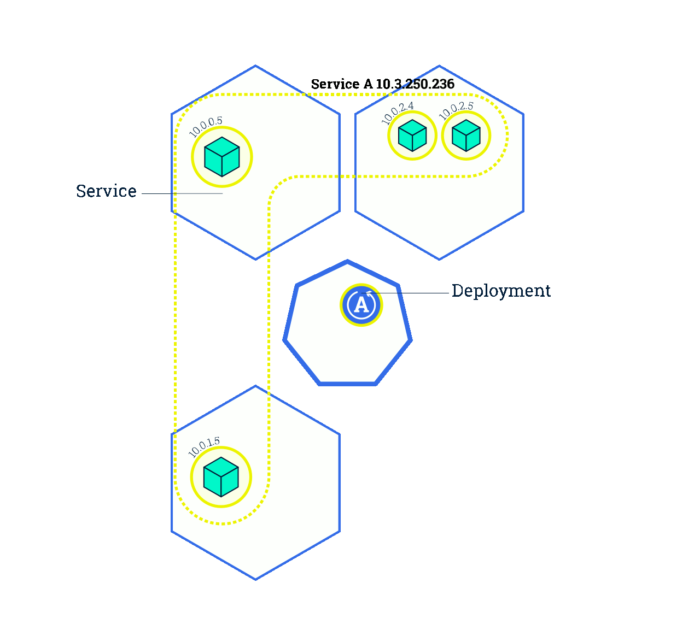
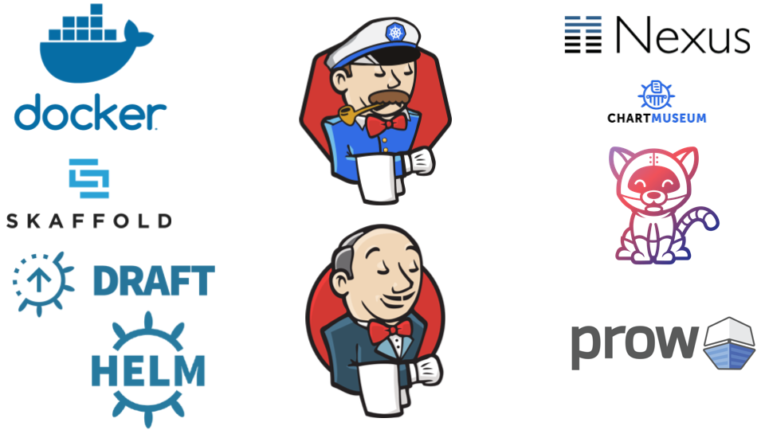
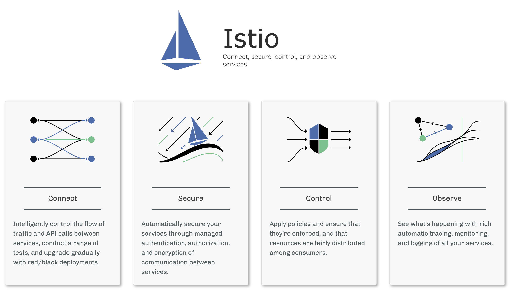

<style>
.container{
    display: flex;
}
.col{
    flex: 1;
}
</style>

<a href="http://jenkins-x.io"> </a>

## Progressive Delivery en Kubernetes

Carlos Sanchez /
[csanchez.org](http://csanchez.org) / 
[@csanchez](http://twitter.com/csanchez)

<a href="http://cloudbees.com"></a>

<!-- <small>[Watch online at carlossg.github.io/presentations](https://carlossg.github.io/presentations)</small> -->

---


# Hola!

Principal Software Engineer @ CloudBees

Author of Jenkins Kubernetes plugin

Long time OSS contributor at Apache Maven, Eclipse, Puppet,…


---


# Progressive Delivery

----

> [Progressive Delivery](https://redmonk.com/jgovernor/2018/08/06/towards-progressive-delivery/) is a term that includes deployment strategies that try to avoid the pitfalls of all-or-nothing deployment strategies

----

> New versions being deployed do not replace existing versions but run in parallel for an amount of time receiving live production traffic, and are evaluated in terms of correctness and performance before the rollout is considered successful.

----

Continuous Delivery is hard

Progressive Delivery makes Continuous Delivery easier to adopt

reduces the risk associated with Continuous Delivery

----

## Progressive Delivery Techniques

----

### Rolling Updates



----

### Blue-Green Deployment

<a href="https://medium.com/continuous-deployment/continuous-deployment-strategies-32e2f7badd2">
  
</a>

----

### Canary Deployment

<a href="https://medium.com/continuous-deployment/continuous-deployment-strategies-32e2f7badd2">
  
</a>

----

## Monitoring is the new testing

Know when users are experiencing issues **in production**

React to the issues **automatically**

---


# Jenkins X

----


----



----


Package manager for Kubernetes

----


Build Docker images with multiple backends: 

* Docker build
* Kaniko
* Google Cloud Build
* Jib (Maven/Gradle)

----


Generates Dockerfile and Helm charts for your project

---


# Progressive Delivery
## with Jenkins X

[jenkins-x.io/developing/progressive-delivery](https://jenkins-x.io/developing/progressive-delivery/)

----

Install Istio and [Flagger](https://docs.flagger.app)

```shell
jx create addon istio
jx create addon flagger
```

----




----

## Prometheus


A systems monitoring and alerting toolkit

----

## Flagger

[flagger.app](https://flagger.app)

> automates the promotion of canary deployments by using Istio’s traffic shifting and Prometheus metrics to analyse the application’s behaviour during a controlled rollout

----

<!--

Get the ip of the Istio ingress and point your wildcard domain to it

```shell
kubectl -n istio-system get service istio-ingressgateway \
  -o jsonpath='{.status.loadBalancer.ingress[0].ip}'
```


Add the [canary object](../charts/croc-hunter-java/templates/canary.yaml) that will add our deployment to Flagger

```yaml
{{- if eq .Release.Namespace "jx-production" }}
{{- if .Values.canary.enable }}
apiVersion: flagger.app/v1alpha2
kind: Canary
metadata:
  name: {{ template "fullname" . }}
spec:
  targetRef:
    apiVersion: apps/v1
    kind: Deployment
    name: {{ template "fullname" . }}
  progressDeadlineSeconds: 60
  service:
    port: {{.Values.service.internalPort}}
{{- if .Values.canary.service.gateways }}
    gateways:
{{ toYaml .Values.canary.service.gateways | indent 4 }}
{{- end }}
```


```yaml
{{- if .Values.canary.service.hosts }}
    hosts:
{{ toYaml .Values.canary.service.hosts | indent 4 }}
{{- end }}
  canaryAnalysis:
    interval: {{ .Values.canary.canaryAnalysis.interval }}
    threshold: {{ .Values.canary.canaryAnalysis.threshold }}
    maxWeight: {{ .Values.canary.canaryAnalysis.maxWeight }}
    stepWeight: {{ .Values.canary.canaryAnalysis.stepWeight }}
{{- if .Values.canary.canaryAnalysis.metrics }}
    metrics:
{{ toYaml .Values.canary.canaryAnalysis.metrics | indent 4 }}
{{- end }}
{{- end }}
{{- end }}
```
-->

Add the `canary` section to our application Helm chart `values.yaml`

```yaml
...
canary:
  enable: true
  service:
    hosts:
    - croc-hunter.istio.us.g.csanchez.org
    gateways:
    - jx-gateway.istio-system.svc.cluster.local
  canaryAnalysis:
    interval: 60s
    threshold: 5
    maxWeight: 50
    stepWeight: 10
```

----

```yaml
    metrics:
    - name: istio_requests_total
      # minimum req success rate (non 5xx responses)
      # percentage (0-100)
      threshold: 99
      interval: 60s
    - name: istio_request_duration_seconds_bucket
      # maximum req duration P99
      # milliseconds
      threshold: 500
      interval: 60s
```

----

## Profit!

```shell
jx promote croc-hunter-java \
  --version 0.0.130 \
  --env production
```

----


----


----


----


---


 [carlossg/croc-hunter-jenkinsx](https://github.com/carlossg/croc-hunter-jenkinsx)

 [carlossg/croc-hunter-java](https://github.com/carlossg/croc-hunter-java)


&nbsp;&nbsp;&nbsp;&nbsp;&nbsp;&nbsp;&nbsp;&nbsp;&nbsp;&nbsp;&nbsp;&nbsp;&nbsp;&nbsp;&nbsp;&nbsp;&nbsp;&nbsp;&nbsp;


----


[quarkus.io](https://quarkus.io/)

A Kubernetes Native Java stack tailored for GraalVM & OpenJDK HotSpot, crafted from the best of breed Java libraries and standards

---


<div class="container">

<div class="col">

<h1>Gracias!</h1>

    <p>[csanchez.org](http://csanchez.org)</p>

    <p>[csanchez](http://twitter.com/csanchez)</p>

    <p> [carlossg](https://github.com/carlossg)</p>
</div>

<!-- <div class="col">
    
</div> -->

<div class="col">
    
</div>
</div>

[](http://cloudbees.com)
