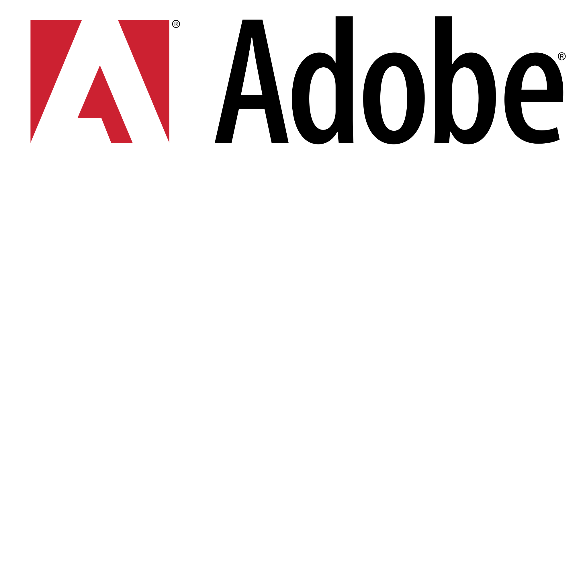
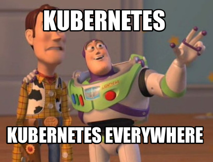

<!--  -->

## GitOps at Adobe

Carlos Sanchez /
[csanchez.org](http://csanchez.org) / 
[@csanchez](http://twitter.com/csanchez)

<!-- <small>[Watch online at carlossg.github.io/presentations](https://carlossg.github.io/presentations)</small> -->

---

Cloud Engineer

@ [Adobe Experience Manager Cloud Service](https://www.adobe.com/marketing/experience-manager/cloud-service.html)

Author of Jenkins Kubernetes plugin

Long time OSS contributor at Apache Maven, Eclipse, Puppet,…

<!--  -->

---

# Why GitOps?

----

# Kubernetes

----

Many clusters

Many regions

Many related services and infrastructure

----

## Benefits

----

### Full view across all sytems

For developers, SREs, on-call,...

----

### Declarative Configuration

----

Using standard YAML

ie. Kubernetes, Kustomize, Helm

and

custom defined

----

### Reconciliation

We keep the desired state in git 

and it is automatically reconciled against what is running

----

### Traceability

Using git logs

----

### Pull Requests

PRs can be deployed to different environments too

----

### Continuous Delivery

Changes in git trigger Jenkins pipelines that test and deploy the definitions

---

# What For?

----

## Applications

Changes in git are automatically deployed across clusters and namespaces

pull vs push when possible

----

## Infrastructure

Can use 

* Terraform
* AWS CloudFormation
* Azure ARM
* Google Cloud Deployment Manager

Then react on git changes deploying and updating the infrastructure

----

### Is this the Real GitOps

or just Infrastructure As Code?

----

## DNS

DNS configuration is stored in git

Using Jenkins and templates we continuously reconcile changes with the DNS API

----

## CDN

CDN configuration is also stored in git

Same Jenkins and templating mechanism to deploy and update CDN configuration

----

## And More!

Grafana

Prometheus

...

---

# Is it just for Humans?

----

## No!

Integrate changes coming from 

* UI
* APIs
* Humans (devs, SREs, on-call,...)

to keep a consistent always up to date view

----

## Decoupling systems and git

Providing services with APIs or using queues

that transform actions into git commits

Yes, you can [trigger Jenkins pipelines from message queues](https://github.com/jenkinsci/jms-messaging-plugin/)

----

## GitOps so far...

---

[csanchez.org](http://csanchez.org)

[csanchez](http://twitter.com/csanchez)

 [carlossg](https://github.com/carlossg)

<!-- 

    

 -->

