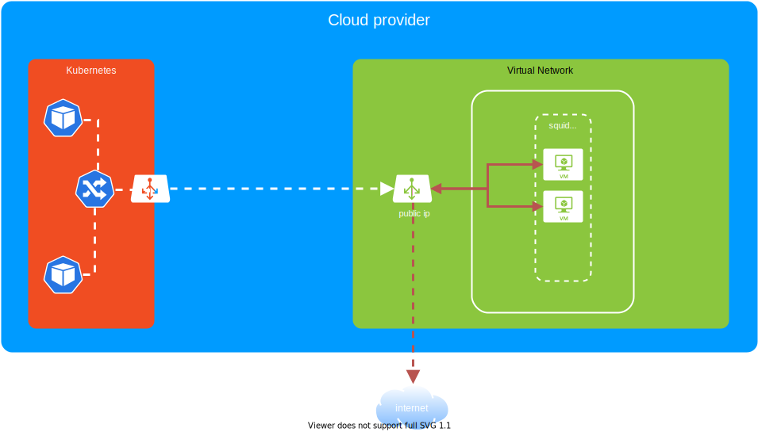

<style>
.container{
    display: flex;
}
.col{
    flex: 1;
}
</style>

## Dedicated Infrastructure in a Multitenant World

<a href="http://adobe.com"></a>

Carlos Sanchez /
[csanchez.org](http://csanchez.org) / 
[@csanchez](http://twitter.com/csanchez)


---

Cloud Engineer

[Adobe Experience Manager Cloud Service](https://www.adobe.com/marketing/experience-manager/cloud-service.html)

Author of Jenkins Kubernetes plugin

Long time OSS contributor at Jenkins, Apache Maven, Puppet,…

---


# Adobe Experience Manager

----

Content Management System

Digital Asset Management

Digital Enrollment and Forms

Used by many Fortune 100 companies

----

An existing distributed Java OSGi application

Using OSS components from Apache Software Foundation

A huge market of extension developers

Writing modules that run in-process on AEM

---


# AEM on Kubernetes

----

Running on Azure

14+ clusters and growing

Multiple regions: US, Europe, Australia, Japan, more coming

Adobe has a dedicated team managing clusters for multiple products

----

Customers can run their own code

Cluster permissions are limited for security

Traffic leaving the clusters must be encrypted for compliance

----

Using namespaces to provide a scope

* network isolation
* quotas
* permissions

----

More details on our Kubernetes setup in my KubeCon 2020 talk

https://tinyurl.com/csanchez-kcna20


----

## Dedicated Infrastructure

Customers want to have dedicated infrastructure

* Egress IPs
* Private connections (VNET peering, Private Link, ExpressRoute, Direct Connect,...)
* VPN

---


# First Version: Squid


Running Squid Proxy in VMs

----



Load Balancer in front of VMs gives a dedicated egress ip

----


<div style="margin-left: -100px;margin-right: -100px;">JVM is configured with Squid as HTTP proxy for transparent forwarding</div>

----


<div style="margin-left: -100px;margin-right: -100px;">k8s network policies prevent one tenant to access a different tenant proxy</div>

----


Each tenant gets a VM auto scale set and a Load Balancer

----


All VMs run in a VNET peered to the k8s cluster VNET

----

## Squid Version: Pros

Simple and transparent config in JVM using http proxy system properties

VNET peering makes traffic private

----

## Squid Version: Cons

Proxy authn/authz is not well supported, needs network policies

Only works for http/s protocol

Http traffic is not encrypted

Does not support other use cases (VPN, private connections,...)

---


# Second Version: Envoy


Running Envoy on VMs and pod sidecars in Kubernetes

----


<div style="margin-left: -100px;margin-right: -100px;">Each tenant gets a VNET, a VM auto scale set and a Load Balancer</div>

----


VNET can be privately connected to customer network

----


Load Balancer in front of VMs gives a dedicated public egress ip

----


<div style="margin-left: -100px;margin-right: -100px;">Private Load Balancer in front of VMs gives a dedicated private egress ip</div>

----


<div style="margin-left: -100px;margin-right: -100px;">JVM is configured with Envoy sidecar as HTTP proxy for transparent forwarding</div>


----


HTTP2 tunnel between sidecar Envoy and VM Envoy with mTLS

----

## Envoy: Pros

Simple and transparent config in JVM using http proxy system properties

Any protocol supported using different listeners in sidecar

All traffic is encrypted

----

## Envoy: Pros

VNET allows configuration of VPN, private connections at cloud level as a service

mTLS prevents unauthorized connections and one tenant to connect to another tenant Envoy

----

## Envoy: Cons

VPN and private connections require a non overlapping ip range with private network

Needs one set of certificates for each tenant for sidecars and VMs: rotation, expiration,...

---


# Envoy Configuration

----

## Envoy Sidecar


One listener with TcpProxy filter for http/s.
`HTTP CONNECT` gives Envoy the destination

----

## Envoy Sidecar


One listener for each non http port.
Destination hardcoded in `tunneling_config`

----

## Envoy Sidecar


One cluster with the VM Envoy LB as endpoint and TLS `transport_socket` config

----

### Envoy Sidecar: Http Listener

```yaml
- name: listener_0
  "@type": type.googleapis.com/envoy.config.listener.
  v3.Listener
  address:
    socket_address:
      protocol: TCP
      address: 0.0.0.0
      port_value: 3128
  filter_chains:
  - filters:
    - name: tcp
      typed_config:
        "@type": type.googleapis.com/envoy.extensions
        .filters.network.tcp_proxy.v3.TcpProxy
        stat_prefix: tcp_stats
        cluster: cluster_0
```

----

### Envoy Sidecar: Non Http Listener

```yaml
- filters:
  - name: tcp
    typed_config:
      "@type": type.googleapis.com/envoy.extensions.
      filters.network.tcp_proxy.v3.TcpProxy
      stat_prefix: tcp_stats
      cluster: cluster_0
      tunneling_config:
        hostname: mysql:3306
```

----

### Envoy Sidecar: Cluster

```yaml
- name: cluster_0
  "@type": type.googleapis.com/envoy.config.cluster.v3.Cluster
  connect_timeout: 5s
  type: logical_dns
  respect_dns_ttl: true
  http2_protocol_options:
    {}
  load_assignment:
    cluster_name: cluster_0
    endpoints:
      - lb_endpoints:
          - endpoint:
              address:
                socket_address:
                  address: envoy_vm
                  port_value: 443
```

----

### Envoy Sidecar: Cluster

```yaml
  transport_socket:
    name: envoy.transport_sockets.tls
    typed_config:
      "@type": type.googleapis.com/envoy.extensions.transport_sockets.tls.v3.UpstreamTlsContext
      common_tls_context:
        tls_certificates:
          - certificate_chain: {
              filename: "/etc/envoy/certs/tls.crt" }
            private_key: { 
              filename: "/etc/envoy/certs/tls.key" }
        tls_params:
          tls_minimum_protocol_version: TLSv1_2
        validation_context:
          trusted_ca: {
            filename: /etc/envoy/cacert.pem}
```

----

## Envoy in VM


One `HttpConnectionManager` listener with `CONNECT` upgrade

----


## Envoy in VM


One `dynamic_forward_proxy` cluster for all destinations

----

## Envoy in VM: Listener

```yaml
- name: listener_0
  "@type": type.googleapis.com/envoy.config.listener.v3.Listener
  address:
    socket_address:
      protocol: TCP
      address: 0.0.0.0
      port_value: 443
  filter_chains:
  - filters:
    - name: envoy.filters.network.http_connection_manager
      typed_config:
        "@type": type.googleapis.com/envoy.extensions
        .filters.network.http_connection_manager.v3.
        HttpConnectionManager
        stat_prefix: ingress_http
```

----

## Envoy in VM: Listener

```yaml
route_config:
  name: local_route
  virtual_hosts:
  - name: local_service
    domains:
      - "*"
    routes:
      - match:
          connect_matcher:
            {}
        route:
          cluster: dynamic_forward_proxy_cluster
          upgrade_configs:
            - upgrade_type: CONNECT
              connect_config:
                {}
      # needed to be used as a proxy with http (not s)
      - match:
          prefix: "/"
        route:
          cluster: dynamic_forward_proxy_cluster
```

----

## Envoy in VM: Listener

```yaml
http_filters:
- name: envoy.filters.http.dynamic_forward_proxy
  typed_config:
    "@type": type.googleapis.com/envoy.extensions.
    filters.http.dynamic_forward_proxy.v3.FilterConfig
    dns_cache_config:
      name: dynamic_forward_proxy_cache_config
      dns_lookup_family: V4_ONLY
- name: envoy.filters.http.router
  typed_config:
    "@type": type.googleapis.com/envoy.extensions.
    filters.http.router.v3.Router
http2_protocol_options:
  allow_connect: true
upgrade_configs:
  - upgrade_type: CONNECT
```

----

## Envoy in VM: Listener

```yaml
transport_socket:
  name: envoy.transport_sockets.tls
  typed_config:
    "@type": type.googleapis.com/envoy.extensions.
    transport_sockets.tls.v3.DownstreamTlsContext
    common_tls_context:
      tls_certificates:
        - certificate_chain: { 
            filename: "/etc/envoy/certs/envoy.pem" }
          private_key: { 
            filename: "/etc/envoy/certs/envoy.key" }
      tls_params:
        tls_minimum_protocol_version: TLSv1_2
      validation_context:
        trusted_ca:
          filename: /etc/envoy/certs/cacert.pem
        # only allow connections with this SAN
        match_subject_alt_names:
          exact: "envoy_sidecar"
    require_client_certificate: true
```

----

## Envoy in VM: Cluster

```yaml
- name: dynamic_forward_proxy_cluster
  "@type": type.googleapis.com/envoy.config.cluster.
  v3.Cluster
  connect_timeout: 1s
  lb_policy: CLUSTER_PROVIDED
  cluster_type:
    name: envoy.clusters.dynamic_forward_proxy
    typed_config:
      "@type": type.googleapis.com/envoy.extensions.
      clusters.dynamic_forward_proxy.v3.ClusterConfig
      dns_cache_config:
        name: dynamic_forward_proxy_cache_config
        dns_lookup_family: V4_ONLY
```

----

## Envoy Config: Resources

envoyproxy.io

[arch_overview/http/upgrades](https://www.envoyproxy.io/docs/envoy/latest/intro/arch_overview/http/upgrades)

[sandboxes/tls](https://www.envoyproxy.io/docs/envoy/latest/start/sandboxes/tls)

[sandboxes/double-proxy](https://www.envoyproxy.io/docs/envoy/latest/start/sandboxes/double-proxy)


----

## Envoy Debugging

TLS connection errors only show up in `connection` component debug logs

Client only sees socket closing messages

----

Example: certificate SAN does not match `match_subject_alt_names`

VM side

```
envoy_vm_1     [debug][connection]
[source/extensions/transport_sockets/tls/ssl_socket.cc:224]
[C0] TLS error: 268435581:SSL routines:
OPENSSL_internal:CERTIFICATE_VERIFY_FAILED
```

Sidecar side

```
envoy_sidecar_1 [debug][connection]
[source/extensions/transport_sockets/tls/ssl_socket.cc:224]
[C1] TLS error: 268436502:SSL routines:
OPENSSL_internal:SSLV3_ALERT_CERTIFICATE_UNKNOWN
envoy_sidecar_1 [debug][connection]
[source/common/network/connection_impl.cc:241]
[C1] closing socket: 0
```


---


<div class="container">

<div class="col">

[csanchez.org](http://csanchez.org)

[csanchez](http://twitter.com/csanchez)

 [carlossg](https://github.com/carlossg)

</div>

<!-- <div class="col">
    
</div> -->

<div class="col">


</div>
</div>


<a href="http://adobe.com"></a>
