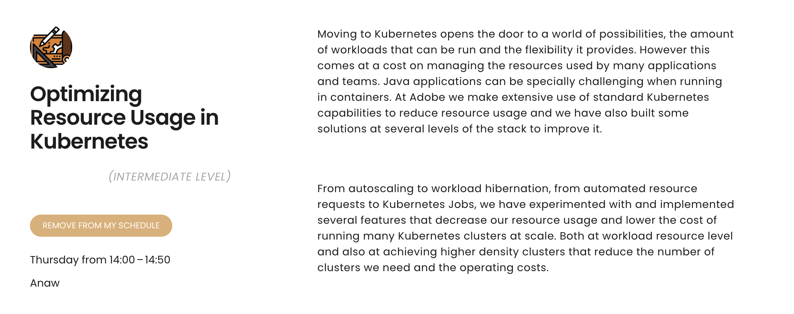

<style>
.container{
    display: flex;
}
.col{
    flex: 1;
}
</style>

## We Moved one Java Product to Kubernetes and This Is What We Learned

<a href="http://adobe.com"></a>

Carlos Sanchez /
[csanchez.org](http://csanchez.org) / 
[@csanchez](http://twitter.com/csanchez)


----

Cloud Engineer

[Adobe Experience Manager Cloud Service](https://www.adobe.com/marketing/experience-manager/cloud-service.html)

Author of Jenkins Kubernetes plugin

Long time OSS contributor at Jenkins, Apache Maven, Puppet,…

---


# Adobe Experience Manager

----

Content Management System

Digital Asset Management

Digital Enrollment and Forms

Used by many Fortune 100 companies

----

An existing distributed Java OSGi application

Using OSS components from Apache Software Foundation

A huge market of extension developers

---


# AEM on Kubernetes

----

Running on Azure

25+ clusters and growing

Multiple regions: US, Europe, Australia, Singapore, Japan, India, more coming

Adobe has a dedicated team managing clusters for multiple products

----

Customers can run their own code

Cluster permissions are limited for security

Traffic leaving the clusters must be encrypted

----

## AEM Environments

* Customers can have multiple AEM environments that they can self-serve
<!-- * Customers run their dev/stage/production -->
* Each customer: 3+ Kubernetes namespaces (dev, stage, prod environments)
* Each environment is a micro-monolith ™
* Sandboxes, evaluation-like environments

Customers interact through Cloud Manager, a separate service with web UI and API

----

Using namespaces to provide a scope

* network isolation
* quotas
* permissions

----

## Services

Multiple teams building services

Different requirements, different languages

You build it you run it

Using APIs or Kubernetes operator patterns

----

## Environments

Using init containers and (many) sidecars to apply division of concerns


---


# Sidecars

* Service warmup
* Storage initialization
* httpd fronting the Java app
* Exporting metrics
* fluent-bit to send logs
* Java threaddump collection
* Envoy proxying
* Autoupdater

----

## Sidecars

* Custom developed (threaddump collector, storage initialization)
* OSS (fluent-bit)
* Extended from OSS (httpd)

----

### Service warmup

Ensure that the service is ready to serve traffic

Probes the most requested paths for lazy caching

Without requiring expensive starts

----

### Exporting metrics

Export system level metrics such as

* disk size 
* disk space
* network reachability

----

### fluent-bit to send logs

Using a shared volume to send logs to a central location

Configured independently from the application

----

### Java threaddump collection

Gets the threaddumps generated by the JVM

and uploads them to a shared location

----

### Envoy proxying

Using Envoy for traffic tunneling and routing

Enables dedicated ips per tenant and VPN connectivity

Can be used as a load balancer and reverse proxy with many features: rate limiting, circuit breaking, retries, etc.

----

### Autoupdater

Runs on startup and updates any configuration needed

Allows patching the whole cluster fleet

---


# Scaling and Resource Optimization

----



---


# Networking


----

## Networking

Kubernetes networking is complex

Multitenancy is even more

Services cannot connect to other namespaces

Everything blocked by default, open on each service case by case

----

## Networking

Everything is virtual

* Allows flexibility
* Introduces complexity


----

## Networking: [Cilium](https://cilium.io/)

* eBPF instead of iptables
* More efficient and performant
* Custom network policies at level 7 (path, header, method,...)

----


## Networking: Cilium

`NetworkPolicy` to block/allow traffic
* Block access to other namespaces
* Allow outgoing https and other common ports

Customers may also want to allow specific ingress ips only, ie. for dev/stage

----

## Networking: Ingress

Custom ingress controller

* With more features than standard Kubernetes `Ingress` object
* blocklist/allowlist, path based routing,...
* Uses Envoy proxy behind the scenes

----

## Networking: Envoy


* ⚠️ Missconfigurations can cause cluster wide issues
* ⚠️ Restarting it when config is wrong will clear all routes
* ⚠️ Locks when the rate of changes is too high

----

## Networking: Envoy

We had to do work to fix issues and use it correctly

ie. Validation of all configs both at build and runtime


----

## Logging

* Using `fluent-bit` sidecars to send logs to centralized store
* [Grafana `loki`](https://grafana.com/oss/loki/) for log aggregation

----

## Monitoring and Alerting


* Multiple Prometheus and Grafana
* Aggregating all clusters data
* Alerts coming from Prometheus AlertManager

----

## Customer Logging

Customers also need access to some logs

* `fluent-bit` sends logs to `loki` service
* Customer can view them in Cloud Manager
* ⚠️ `logstash` is heavy, 2GB+ memory needed, `loki` a better option

----

## Resiliency and Self Healing


* [Readiness and liveness probes](https://cloud.google.com/blog/products/gcp/kubernetes-best-practices-setting-up-health-checks-with-readiness-and-liveness-probes) so services are marked unavailable and restarted automatically
* [`PodDisruptionBudget`](https://kubernetes.io/docs/tasks/run-application/configure-pdb/) to ensure a number of replicas on rollouts and cluster upgrades
* [`topologySpreadConstraints`](https://kubernetes.io/docs/concepts/scheduling-eviction/topology-spread-constraints/) to distribute service across nodes and availability zones

----

## Shutting Down

Handling `SIGTERM` to shutdown gracefully

`terminationGracePeriodSeconds` to allow services to finish their work


----

## Multitenancy

Limit blast radius

Customers are namespace isolated

⚠️ All deployments **must** have CPU/memory requests and limits

----

### Running Customer Code


Pods that run customer code are a higher risk

Started testing Kata Containers, pod runs in a VM transparently

Contributing improvements upstream

----

### Security Profiles Operator

Using SELinux, seccomp and AppArmor in Kubernetes

Allows recording, auditing and blocking system calls

---


# External Services

----

## Persistence

Remove all usage of local storage

* External MongoDB
* Azure Blob Storage

----

## Persistence

Kubernetes Persistent Volumes are not very scalable

* ⚠️ In the past hit API rate limitting at 100s of Persistent Volumes
* It is supposed to have improved

----

## Data Processing

Using Kafka based service to sync data between author and publish

Works worldwide, when publishers are in multiple regions

----

## CDN: Fastly


<br/>

* Fastly in front of the Load Balancer
* Binary content stored in Azure blobs

----

## Egress Connectivity Extensions

Dedicated ip requested by some customers for firewall configuration

Or to avoid being throttled/blocked by other tenants

VPN connections

----

## Egress Dedicated ip

Scale set of Envoy proxies dedicated per customer

Dedicated egress load balancer that sets the outgoing ip

Using Envoy to tunnel from sidecar to outgoing load balancer

Short lived certificates for mTLS tunnels

----

## Private Connections

Customers can connect through VPN to their private networks

Using transparently Azure VPN Gateway at the end of the Envoy mTLS tunnels

---


# Continuous Delivery

----

AEM: From yearly to daily release


----

Using Jenkins for CI/CD

Tekton and other services to orchestrate pipelines

----

## GitOps

Most configuration is stored in git
and reconciled on each commit

Pull vs Push model to scale

----

## Kubernetes Deployments

Combination of 

* Helm: AEM application
* Plain Kubernetes files: ops services
* Kustomize: some new microservices

----

## Helm

⚠️ Don't mix application and infra in the same package

Helm operator to pull in each namespace

----

## Progressive Delivery

Rollout to different customer groups in separate waves

Rollout to a percentage of customers

Global Helm overrides using Helm values or Kustomize patches through the Helm operator

----

## Shift Left

Detect problems as soon as possible, not in production

Running checks on PRs so developers can act on them asap

Generating the gitops and helm templates and running multiple tests

----

### Kubectl Apply Dry Run

The most basic check

```
kubectl apply --dry-run=server
```

----

### Kubeconform

`Kubeconform` to validate Kubernetes schemas

Succesor of `Kubeval`

We added schema validation of some custom CRDs

----

### Conftest

`Conftest` to validate policies while allowing developer autonomy

* security recommendations
* labelling standards
* image sources

Using Rego language 🥺

----

### Pluto

`Pluto` to detect API versions deprecated or removed


---


<div class="container">

<div class="col">

[csanchez.org](http://csanchez.org)

[csanchez](http://twitter.com/csanchez)

 [carlossg](https://github.com/carlossg)

</div>

<!-- <div class="col">
    
</div> -->

<div class="col">


</div>
</div>


<a href="http://adobe.com"></a>
