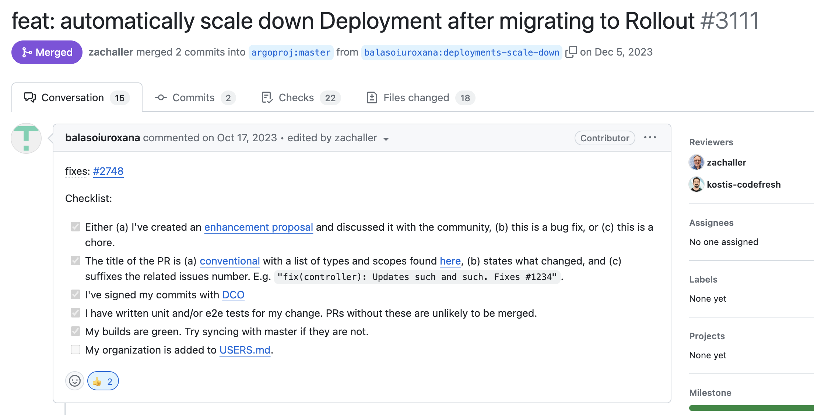

<style>
.container{
    display: flex;
}
.col{
    flex: 1;
}
</style>

### Progressive Delivery Made Easy with Argo Rollouts

<a href="http://adobe.com"></a>

Natalia Angulo /
[github.com/angulito](https://github.com/angulito) / 
[@nangulito](http://twitter.com/nangulito)

Carlos Sanchez /
[csanchez.org](http://csanchez.org) / 
[@csanchez](http://twitter.com/csanchez)


---


**Natalia** / Software Developer Engineer

Maths, coding

<br/>

**Carlos** / Principal Scientist

OSS contributor, Jenkins Kubernetes plugin

<br/>

[Adobe Experience Manager Cloud Service](https://www.adobe.com/marketing/experience-manager/cloud-service.html)

---


# Adobe Experience Manager

----

An existing distributed Java OSGi application

Using OSS components from Apache Software Foundation

A huge market of extension developers

---


# AEM on Kubernetes

----

Running on **Azure**

**45+ clusters** and growing

**Multiple regions**: US, Europe, Australia, Singapore, Japan, India, more coming

Adobe has a **dedicated team** managing clusters for multiple products

----

<!-- Customers can **run their own code**

**Cluster permissions** are **limited** for security

ie. Traffic leaving the clusters must be encrypted -->


## AEM Environments

* Customers can have multiple AEM environments that they can self-serve
<!-- * Customers run their dev/stage/production -->
* Each customer: 3+ Kubernetes namespaces
* Each environment is a micro-monolith ™
<!-- * Sandboxes, evaluation-like environments

Customers interact through Cloud Manager, a separate service with web UI and API -->

----

Using namespaces to provide a scope

* network isolation
* quotas
* permissions

----

## Services

Multiple teams building services

Different requirements, different languages

You build it you run it

Using APIs or Kubernetes operator patterns

----

## Environments

Using init containers and (many) sidecars to apply division of concerns


---


## Scale

17k+ environments

100k+ `Deployments`

6k+ namespaces

Already doing progressive rollouts at the environment level

----

## Challenges

How to avoid issues in production

deploying Adobe code / customer code 

For 17k+ unique services 

----

## Challenges

Full end to end testing is expensive

Does not cover all cases and does not scale

If a few environments fail it requires analysis

* is it an AEM release issue?
* is it a customer code issue?
* is it a temporary issue?

----

## Challenges

It is time consuming

Releases can get delayed

Issues can impact 100% of one environment traffic

---


---


# Our setup

Canary deployments with automatic rollback

Based on real world traffic and error metrics

Using existing metrics from Prometheus

----

Two deployments tied together (author & publish)

Rolling both at the same time

In the future may consider a Helm rollback

----

```yaml
apiVersion: argoproj.io/v1alpha1
kind: Rollout
metadata:
  name: "{{ $fullName }}-publish"
spec:
  selector:
    matchLabels:
      app: "{{ $fullName }}-publish"
  workloadRef:
    apiVersion: apps/v1
    kind: Deployment
    name: "{{ $fullName }}-publish"
```

----

```yaml
  strategy:
    canary:
      stableMetadata:
        labels:
          role: stable
      canaryMetadata:
        labels:
          role: canary
```

----

```yaml
apiVersion: argoproj.io/v1alpha1
kind: AnalysisTemplate
metadata:
  name: "rollout-success-rate"
spec:
  args:
  - name: aem_service
  metrics:
  - name: success-rate
    interval: 5m
    # NOTE: prometheus queries return results in the form of a
    # vector. So it is common to access the index 0 of the
    # returned array to obtain the value
    successCondition: |
      len(result) == 0 || isNaN(result[0]) || result[0] < 0.1
    failureLimit: 3
```

----

```yaml
provider:
    prometheus:
    address: |
        http://prometheus-aem-prometheus-server.namespace.svc.cluster.local:80
    query: |
        request_error_ratio_5m{
        pod_label_role="canary",
        aem_tier=~"author|publish",
        aem_service=~"{{args.aem_service}}"
        }
```


---

# The Good

Automatic roll back on high error rates

Non blocking rollouts across environments and async investigation

Reduced blast radius

----

# The Good

Only a percentage of traffic is affected temporarily

More frequent releases

Validate with real traffic

More velocity

---

# The Bad

Migration requires orchestration to avoid downtime

Even using `workloadRef`

A problem with 1000s of services


----



[argo-rollouts PR #3111](https://github.com/argoproj/argo-rollouts/pull/3111)

----

##### Reference Deployment From Rollout

<div style="font-size: 0.6em">

Instead of removing Deployment you can scale it down to zero and reference it from the Rollout resource:

1. Create a Rollout resource.
1. Reference an existing Deployment using `workloadRef` field.
1. In the `workloadRef` field set the `scaleDown` attribute, which specifies how the Deployment should be scaled down. There are three options available:
   * `never`: the Deployment is not scaled down
   * `onsuccess`: the Deployment is scaled down after the Rollout becomes healthy
   * `progressively`: as the Rollout is scaled up the Deployment is scaled down.

</div>

---

# The Ugly

Start with simple rollouts, watch for degraded status

* prometheus is not reachable
* upgrades with object deletion

----

## Immutable Resources

Immutable `ConfigMap` and `Secret` are a solution for high load in the API server

Each change to them needs a new name (typically including a checksum of content)

ie. `mysecret-abcde`

----

Example:

* Helm upgrade
* new secret is created `mysecret-abcde1`
* old secret is deleted `mysecret-abcde0`
* new pods fail to start per Rollout config

----

* Argo does a rollback to previous deployment
* more pods of the old deployment cannot be created as old secret no longer exists
* outage as soon as existing pods are recycled


----

Need good metrics

Metrics need to account for `canary`/`stable` labels

What happens with environments with low traffic?

`Rollout` requires changing runbooks, tooling and training

---


Progressive Delivery is a great idea

Argo Rollouts is a great implementation

Some things to iron out and prepare for


---


<div class="container">

<div class="col">

[nangulito](http://twitter.com/nangulito)

 [angulito](https://github.com/angulito)

<p>&nbsp;</p>
<p>&nbsp;</p>

<a href="http://adobe.com"></a>

</div>

<!-- <div class="col">
    
</div> -->

<div class="col">

[csanchez](http://twitter.com/csanchez)

 [carlossg](https://github.com/carlossg)

<!-- [csanchez.org](http://csanchez.org) -->

</img>


</div>
</div>
