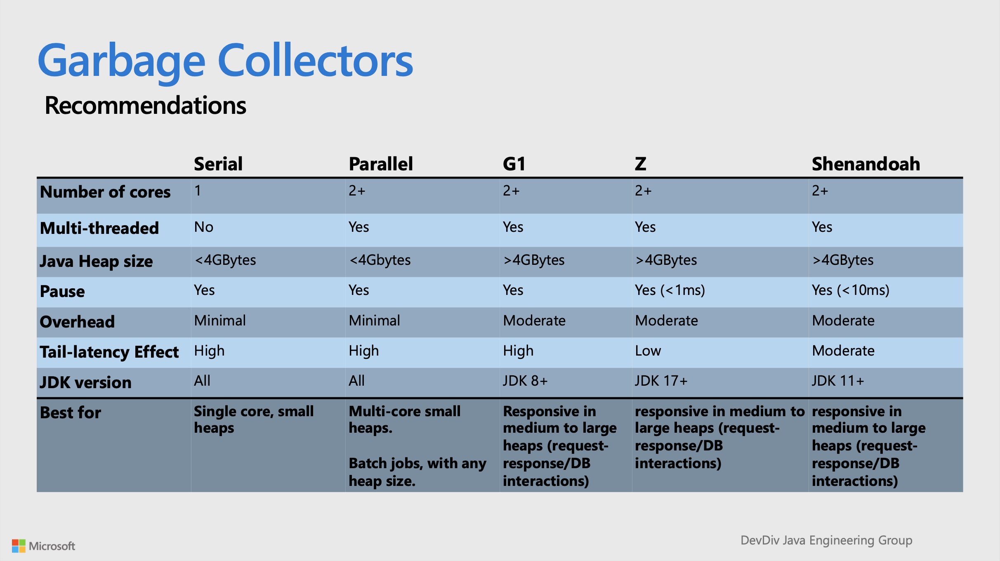
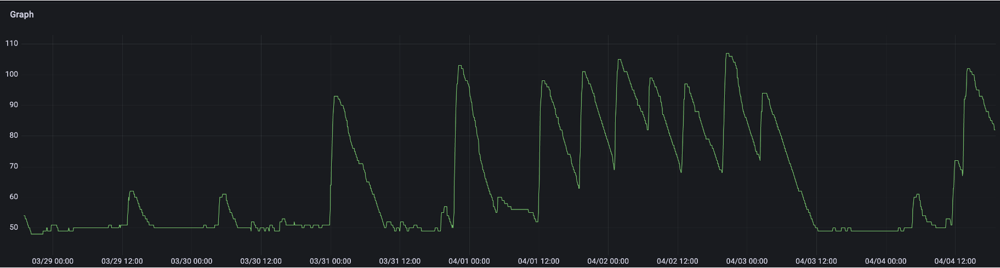
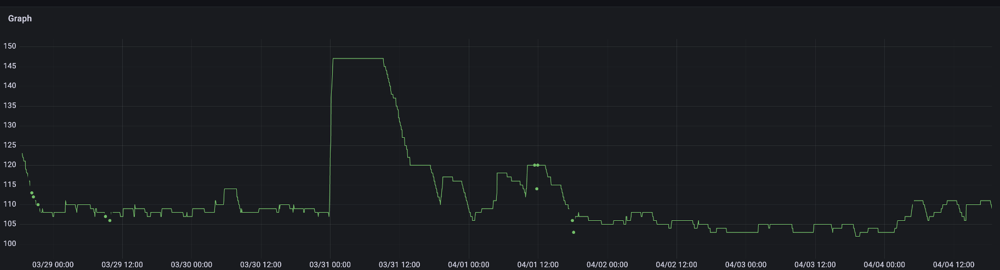

<style>
.container{
    display: flex;
}
.col{
    flex: 1;
}
</style>

<!-- <a href="http://jenkins-x.io"> </a> -->

### Lessons Learned Migrating an Existing Product to a Multi Tenant Cloud Native Environment

<a href="http://adobe.com"></a>

Carlos Sanchez

<small>

[csanchez.org](http://csanchez.org) /
[@csanchez](http://twitter.com/csanchez) /
[@csanchez@fosstodon.org](https://fosstodon.org/@csanchez)

</small>


<!-- <small>[Watch online at carlossg.github.io/presentations](https://carlossg.github.io/presentations)</small> -->

----

Principal Scientist

[Adobe Experience Manager Cloud Service](https://www.adobe.com/marketing/experience-manager/cloud-service.html)

Long time OSS contributor at Jenkins, Apache Maven, Puppet,…

Author of Jenkins Kubernetes plugin

---


# Adobe Experience Manager

----

An existing distributed Java OSGi application

Using OSS components from Apache Software Foundation

A huge market of extension developers

---


# AEM on Kubernetes

----

Running on **Azure**

**45+ clusters** and growing

**Multiple regions**: US, Europe, Australia, Singapore, Japan, India, more coming

Adobe has a **dedicated team** managing clusters for multiple products

----

17k+ environments

100k+ `Deployments`

6k+ namespaces

----

<!-- Customers can **run their own code**

**Cluster permissions** are **limited** for security

ie. Traffic leaving the clusters must be encrypted -->


## AEM Environments

* Customers can have multiple AEM environments that they can self-serve
<!-- * Customers run their dev/stage/production -->
* Each customer: 3+ Kubernetes namespaces
* Each environment is a micro-monolith ™
<!-- * Sandboxes, evaluation-like environments

Customers interact through Cloud Manager, a separate service with web UI and API -->

----

Using namespaces to provide a scope

* network isolation
* quotas
* permissions

----

## Services

Multiple teams building services

Different requirements, different languages

You build it you run it

Using APIs or Kubernetes operator patterns

----

## Environments

Using init containers and (many) sidecars to apply division of concerns


---


# Sidecars


----

* Service warmup
* Storage initialization
* httpd fronting the Java app
* Exporting metrics
* fluent-bit to send logs
* Java threaddump collection
* Envoy proxying
* Autoupdater

----

<!-- ## Sidecars

* Custom developed (threaddump collector, storage initialization)
* OSS (fluent-bit)
* Extended from OSS (httpd)

-->

### Service warmup

Ensure that the service is ready to serve traffic

Probes the most requested paths for lazy caching

Without requiring expensive starts

----

### fluent-bit to send logs

Using a shared volume to send logs to a central location

Configured independently from the application

----

### Envoy proxying

Using Envoy for traffic tunneling and routing

Enables dedicated ips per tenant and VPN connectivity

----

### Autoupdater

Runs on startup and updates any configuration needed

Allows patching the whole cluster fleet live

---


# Operators

----

## AEM Environment Operator

Overarching operator that manages lifecycle of environments


----

### AEM Environment Operator

An operator to rule them all

Launches jobs pre/post environment creation

**Reconciles** with other **internal operators**

----

## FluxCD Helm Operator

https://fluxcd.io/

----

### FluxCD Helm Operator

Allows **managing Helm charts** using **declarative** state vs imperative commands

Integrated with our operators to manage the lifecycle of the Helm releases

and to **gather state** from the Helm operations

----

## ArgoCD


----

### ArgoCD

https://argoproj.github.io

Applies **GitOps** state into the cluster

Widely used at Adobe

Includes workflows, events, ...

----

## Argo Rollouts

https://argoproj.github.io/rollouts/

----

### Argo Rollouts

Provides **advanced deployment strategies**

Canary, Blue/Green, A/B testing, etc.

**Automated rollbacks**


---


# Scaling and Resource Optimization

----

Each customer environment (17k+) is a micro-monolith ™

Multiple teams building services

Need ways to scale that are orthogonal to the dev teams

----

Kubernetes workloads can define resource requests and limits:

Requests:

how many resources are guaranteed

Limits:

how many resources can be consumed

----

And are applied to

CPU

Memory

Ephemeral storage

----

Memory: limit enforced, results in Kernel OOM killed

Ephemeral storage: limit enforced, results in pod eviction

----

### CPU requests in Kubernetes

It is used for scheduling and then a relative weight

It is not the number of CPUs that can be used

1 CPU means it can consume one CPU cycle per CPU period

Two containers with 0.1 cpu requests each can use 50% of the CPU time of the node

----

### CPU limits in Kubernetes

This translates to cgroups quota and period.

Period is by default 100ms

The limit is the number of CPU cycles that can be used in that period

After they are used the container is throttled

----

<!-- ### CPU limits in Kubernetes

Example

`500m` in Kubernetes -> 50ms of CPU usage in each 100ms period

`1000m` in Kubernetes -> 100ms of CPU usage in each 100ms period -->


```
+----------+   +-----------------------------+   +-----------
|  Core 1  |   | Thread 1                    |   |  Thread 1
+----------+   +-----------------------------+   +-----------
+----------+   
|  Core 2  |   
+----------+   
+----------+   
|  Core 3  |   
+----------+   
+----------+   
|  Core 4  |   
+----------+   
               <----------------------------->   <-----------
                        Period 100 ms
```

----


### CPU limits in Kubernetes

This is challenging for Java and multiple threads

For `1000m` in Kubernetes and 4 threads

you can consume all the CPU time in 25ms and be throttled for 75 ms

----

```
+----------+   +-----------------------------+   +-----------
|  Core 1  |   | Thread 1 ~~~~~~~~~~~~~~~~~~~|   |  Thread 1
+----------+   +-----------------------------+   +-----------
+----------+   +-----------------------------+   +-----------
|  Core 2  |   | Thread 2 ~~~~~~~~~~~~~~~~~~~|   |  Thread 2
+----------+   +-----------------------------+   +-----------
+----------+   +-----------------------------+   +-----------
|  Core 3  |   | Thread 3 ~~~~~~~~~~~~~~~~~~~|   |  Thread 3
+----------+   +-----------------------------+   +-----------
+----------+   +-----------------------------+   +-----------
|  Core 4  |   | Thread 4 ~~~~~~~~~~~~~~~~~~~|   |  Thread 4
+----------+   +-----------------------------+   +-----------
               <----------------------------->   <-----------
                        Period 100 ms
                          <------------------>
                               Throttling
```

----


## ARM architecture

15-25% cost savings for the same performance

Easy switch for containerized Java

---


# Java and Kubernetes

----

## Quizz

Assume:

* Java 11+ and latest releases
* 4GB memory available
* 2+ CPUs available

----

### What is the default JVM heap size?

1. 75% of container memory
2. 75% of host memory
3. 25% of container memory
4. 25% of host memory
5. 127MB


----

### What is the default JVM heap size?

1. **75% of container memory** (< 256 MB)
2. 75% of host memory
3. **25% of container memory** (> 512 MB)
4. 25% of host memory
5. **127MB** (256 MB to 512 MB)

----

JDKs >=8u191 and >=11 will detect the available memory in the container, not the host

Using the container memory limits, so there is no guarantee that physical memory is available

----

Do not trust JVM ergonomics

Configure memory with

* `-XX:InitialRAMPercentage`
* `-XX:MaxRAMPercentage`
* ~~`-XX:MinRAMPercentage`~~ (allows setting the maximum heap size for a JVM running with less than 200MB)

----

Typically can use up to 75% of container memory

Unless there is a lot of off-heap memory used (ElasticSearch, Spark,...)

JVM takes all the memory on startup and manages it

JVM memory use is hidden from Kubernetes, which sees all of it as used

Set request and limits to the same value

----

### What is the default JVM Garbage Collector?

1. SerialGC
2. ParallelGC
3. G1GC
4. ZGC
5. ShenandoahGC

----

### What is the default JVM Garbage Collector?

1. **SerialGC**   *<2 processors & < 1792MB available*
2. **ParallelGC** *Java 8*
3. **G1GC**       *Java >=11*
4. ZGC
5. ShenandoahGC


----

Poorly tuned GC will cause pauses and other issues

----

Do not trust JVM ergonomics

Configure GC with

* `-XX:+UseSerialGC`
* `-XX:+UseParallelGC`
* `-XX:+UseG1GC`
* `-XX:+UseZGC`
* `-XX:+UseShenandoahGC`


----



----

### How many CPUs will the JVM be able to use?

1. Same as the k8s container cpu requests
2. Same as the k8s container cpu limits
3. As many as the OS allows

----

### How many CPUs will the JVM be able to use?

1. Same as the k8s container cpu requests
2. **Same as the k8s container cpu limits** <17.0.5 / <11.0.17 / <8u351
3. **As many as the OS allows** Java 19+ / 17.0.5+ / 11.0.17+ / 8u351+

----

Before Java 19/17.0.5/11.0.17/8u351

* 0 ... 1023 = 1 CPU
* 1024 = (no limit)
* 2048 = 2 CPUs
* 4096 = 4 CPUs

----

[JDK-8281181 Do not use CPU Shares to compute active processor count](https://bugs.openjdk.org/browse/JDK-8281181)

> the JDK interprets cpu.shares as an absolute number that limits how many CPUs the current process can use

Kubernetes sets `cpu.shares` from the CPU requests


----

Do not trust JVM ergonomics

Configure cpus with

* `-XX:ActiveProcessorCount`

----

### In a 32 CPU host with 2 JVMs with same requests, what is the max cpu that each can use?

|           | limit=8 | limit=16 | no limit |
| --------- | ------- | -------- | -------- |
| one 100%  |        |        |        |
| both 100% |        |        |        |

----

### In a 32 CPU host with 2 JVMs with same requests, what is the max cpu that each can use?

|           | limit=8 | limit=16 | no limit |
| --------- | ------- | -------- | -------- |
| one 100%  | 8       |        |        |
| both 100% | 8       |        |        |


----

### In a 32 CPU host with 2 JVMs with same requests, what is the max cpu that each can use?

|           | limit=8 | limit=16 | no limit |
| --------- | ------- | -------- | -------- |
| one 100%  | 8       | 16       |       |
| both 100% | 8       | 16       |       |


----

### In a 32 CPU host with 2 JVMs with same requests, what is the max cpu that each can use?

|           | limit=8 | limit=16 | no limit |
| --------- | ------- | -------- | -------- |
| one 100%  | 8       | 16       | 32       |
| both 100% | 8       | 16       | 16       |


<!-- ### Secrets of Performance Tuning Java on Kubernetes

by @brunoborges

https://2022.javazone.no/#/program/77f4b4f6-094a-44ba-a23f-0fd505e8d9d6
 -->

<!-- 

# Scaling

* ⚠️ API rate limits can be hit on upgrades, so we limit each cluster in the hundreds of nodes

* You could have bigger nodes too

Using Kubernetes Vertical and Horizontal Pod Autoscaler -->


---


# Kubernetes Autoscaling

----

## Kubernetes Autoscaling

* Cluster Autoscaler
* Horizontal Pod Autoscaler
* Vertical Pod Autoscaler

---


# Kubernetes Cluster Autoscaler

Automatically increase and reduce the cluster size

Based on CPU/memory requests

----

## Kubernetes Cluster Autoscaler

**Max nodes** managed at the cluster level

Savings: 30-50%

----



----



---


# Vertical Pod Autoscaler

Increasing/decreasing the resources for each pod

Requires **restart of pods** (automatic or on next start)

(next versions of Kubernetes will avoid it)


----

## VPA

Only used in AEM **dev environments** to scale down if unused

Savings: 5-15%

---


# Horizontal Pod Autoscaler

Creating more pods when needed

----

## HPA


AEM scales on **CPU and http requests** per minute (rpm) metrics

⚠️ Do not use same metrics as VPA

**CPU autoscaling** is problematic

Periodic tasks can spike the CPU, **more pods do not help**

Spikes on **startup** can trigger a **cascading effect**

Savings: 50-75%

---


Easy to start in k8s, then optimize

Use patterns to decompose application: sidecars, init containers, new services,...

Resource optimization: tuning JVM CPU, memory, GC


---


<div class="container">

<div class="col">

[csanchez.org](http://csanchez.org)

[csanchez](http://twitter.com/csanchez)

 [carlossg](https://github.com/carlossg)

</div>

<!-- <div class="col">
    
</div> -->

<div class="col">


</div>
</div>


<a href="http://adobe.com"></a>
