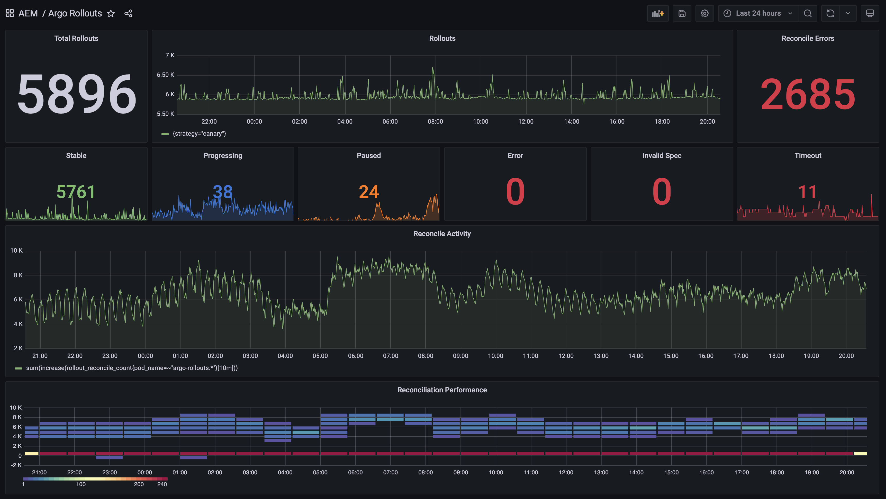
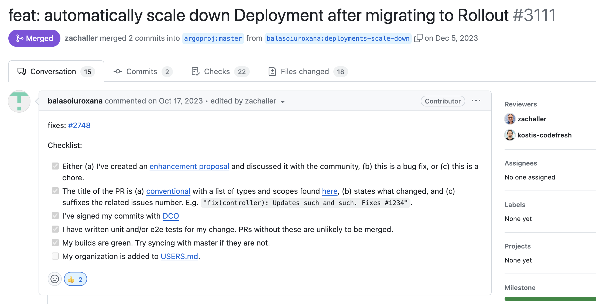
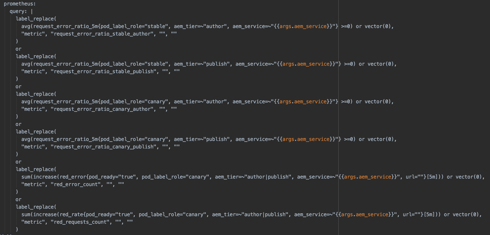

<style>
.container{
    display: flex;
}
.col{
    flex: 1;
}
</style>

### Tuning Argo Rollouts for Thousands of Workloads

<a href="http://adobe.com"></a>

Roxana Balasoiu / Carlos Sanchez


---


**Roxana / Software Developer Engineer**

problem-solving enthusiast, cloud engineering

[balasoiuroxana](https://github.com/balasoiuroxana) /
[@balasoiuroxana](http://twitter.com/balasoiuroxana)

**Carlos / Principal Scientist**

OSS contributor, Jenkins Kubernetes plugin

[csanchez.org](http://csanchez.org) / 
[@csanchez](http://twitter.com/csanchez)


**[Adobe Experience Manager Cloud Service](https://www.adobe.com/marketing/experience-manager/cloud-service.html)**

---


# Adobe Experience Manager

----

A Content and Digital Asset Management system

An existing distributed Java OSGi application

Using OSS components from Apache Software Foundation

A huge market of extension developers

----

Running on **Azure**

**50+ clusters** and growing

**Multiple regions**: US+, Europe+, Australia, Singapore, Japan, India, more coming

<!-- Adobe has a **dedicated team** managing clusters for multiple products -->

----

## Services

Multiple teams building services

Different requirements, different languages

You build it you run it

Using APIs or Kubernetes operator patterns

<!-- ----

## Environments

Using init containers and (many) sidecars to apply division of concerns

 -->

---


# Scale

17k+ environments

200k+ `Deployments`

10k+ namespaces

Already doing progressive rollouts at the environment and namespace level

----

## Challenges

How to avoid issues in production

deploying Adobe code / customer code 

For 17k+ unique services 

----

## Challenges

Full end to end testing is expensive

Does not cover all cases and does not scale

If a few environments fail it requires analysis

* is it an AEM release issue?
* is it a customer code issue?
* is it a temporary issue?

----

## Challenges

It is time consuming

Releases can get delayed

Issues can impact 100% of one environment traffic

---


---


# Our setup

Canary deployments with automatic rollback

Based on real world traffic and error metrics

Using existing metrics from Prometheus

----

## Scale

6k `Rollout` objects

10k reconciliations in average (up to 5k per cluster)


----



----

## Rollout of the Rollout

Slow to avoid issues

Watch for quotas as Deployments are scaled down and Rollouts up

Dry run mode to look for issues

----

## Reverting the Rollouts

Disabling Rollouts require scaling up the `Deployment` object

----

## Migration

`Rollout` requires changing runbooks, tooling and training

Teaching engineers about `Rollouts`, `Deployments` scaled down to 0 are confusing


----

Two deployments tied together (author & publish)

Rolling both at the same time

In the future may consider a Helm rollback

----

<!--
```yaml
apiVersion: argoproj.io/v1alpha1
kind: Rollout
metadata:
  name: "{{ $fullName }}-publish"
spec:
  selector:
    matchLabels:
      app: "{{ $fullName }}-publish"
  workloadRef:
    apiVersion: apps/v1
    kind: Deployment
    name: "{{ $fullName }}-publish"
```


```yaml
  strategy:
    canary:
      stableMetadata:
        labels:
          role: stable
      canaryMetadata:
        labels:
          role: canary
```
-->


## Analysis Template

Combining 6 metrics:

Error ratio in stable vs canary

Number of errors in canary

Number of requests in both stable and canary

Combine two deployments together

----

## Analysis Template using AI

Easily implemented using canary analysis jobs


----

## The customer view

Differentiating customer triggered vs internal

Avoid confusing external users with no feedback

Rolling back changes without user feedback can create confusion

Be mindful of users who have strict requirements for fast deployments


---

# Benefits

Automatic roll back on high error rates

Non blocking rollouts across environments and async investigation

Reduced blast radius

----

# Benefits

Only a percentage of traffic is affected temporarily

More frequent releases

Validate with real traffic

More velocity

---

# Challenges

Migration requires orchestration to avoid downtime

A problem with 1000s of services

Better with `workloadRef` and `scaleDown` attribute

----

# Challenges

Scale `Deployment` down to zero and reference it from the `Rollout` with `workloadRef` field.

`scaleDown` attribute: `never`, `onsuccess`, `progressively`

</div>

----

## Migration



[argo-rollouts PR #3111](https://github.com/argoproj/argo-rollouts/pull/3111)


----

# Challenges

Start with simple rollouts, watch for degraded status

* prometheus is not reachable
* upgrades with object deletion

----

## Immutable Resources

Immutable `ConfigMap` and `Secret` are a solution for high load in the API server

Each change to them needs a new name (typically including a checksum of content)

ie. `mysecret-abcde`

----

Example:

* Helm upgrade
* new secret is created `mysecret-abcde1`
* old secret is deleted `mysecret-abcde0`
* new pods fail to start per Rollout config

----

* Argo does a rollback to previous deployment
* more pods of the old deployment cannot be created as old secret no longer exists
* outage as soon as existing pods are recycled


----

## Metrics

Figuring out the correct metrics

Metrics need to account for `canary`/`stable` labels

Recognize low-traffic environments

Identify environments already experiencing errors

Check errors in multiple deployments if they work together

<!-- Use dry-run mode until the suitable metrics are found -->


----



----

## Steps

Setting the steps correctly

Short steps may not catch issues

Long pauses or many steps can significantly increase deployment duration

----

## False Positives / Negatives

Review number of Rollouts that are not promoted

Fix and iterate

----

## Handling Failures

Look for degraded rollouts: InvalidSpec, timeout (replicaset fails to be ready), error, abort

----

## Costs

Increase in cost for the added safety


---


Progressive Delivery is a great idea

Argo Rollouts is a great implementation

Some things to iron out and prepare for

---


<div class="container">

<div class="col">


 [balasoiuroxana](https://github.com/balasoiuroxana)

[balasoiuroxana](http://twitter.com/balasoiuroxana)

</div>

<!-- <div class="col">
    
</div> -->

<div class="col">

 [carlossg](https://github.com/carlossg)

[csanchez](http://twitter.com/csanchez)

<!-- [csanchez.org](http://csanchez.org) -->

<!-- </img> -->


</div>
</div>

<a href="http://adobe.com"></a>
