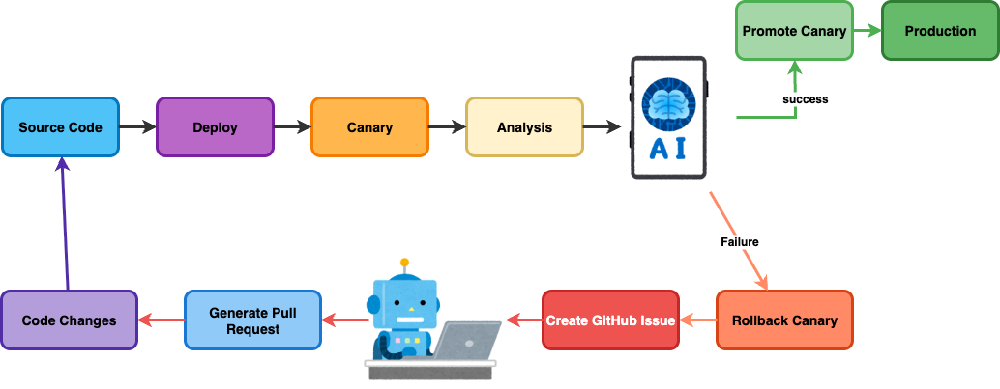

## Self-Healing Rollouts

#### Automating Production Fixes with Agentic AI
#### & Argo Rollouts

Carlos Sanchez /
[csanchez.org](http://csanchez.org)
/
[@csanchez](https://bsky.app/profile/csanchez.bsky.social)
<!-- /
[@csanchez@fosstodon.org](https://fosstodon.org/@csanchez) -->

<!-- <small>[Watch online at presentations.csanchez.org](https://presentations.csanchez.org/)</small> -->

----

Principal Scientist

[Adobe Experience Manager Cloud Service](https://www.adobe.com/marketing/experience-manager/cloud-service.html)

Long time OSS contributor at Kubernetes, Jenkins, Apache Maven,…

<!--  -->

---

# Progressive Delivery

----

> [Progressive Delivery](https://redmonk.com/jgovernor/2018/08/06/towards-progressive-delivery/) is a term that includes deployment strategies that try to avoid the pitfalls of all-or-nothing deployment strategies

----

> New versions being deployed do not replace existing versions but run in parallel for an amount of time receiving live production traffic, and are evaluated in terms of correctness and performance before the rollout is considered successful.

----

----

----

<!-- Continuous Delivery is hard

Progressive Delivery makes Continuous Delivery easier to adopt

reduces the risk associated with Continuous Delivery -->

* Avoiding downtime
* Limit the blast radius
* Shorter time from idea to production

---

# Progressive Delivery Techniques

----

## Rolling Updates

----

## Blue-Green Deployment

----

## Canary Deployment

----

## Dark Launching

----

## Feature Flags

----

## Monitoring is the new testing

Know when users are experiencing issues **in production**

React to the issues **automatically**

----

> If you haven't automatically destroyed something by mistake, you are not automating enough

---

# Progressive Delivery in Kubernetes

----

### Kubernetes Service Architecture

----

### Kubernetes Ingress Architecture

----

### Kubernetes Ingress

Ingress controllers:

* AWS
* GCE
* nginx
* Ambassador
* Istio Ingress
* Traefik
* HAProxy
* ...

---

## Argo Rollouts

----

## Argo Rollouts

> provides advanced deployment capabilities such as blue-green, canary, canary analysis, experimentation, and progressive delivery features to Kubernetes.

----

## Argo Rollouts

----

<!--  -->

----

----

----

---

Rolling out changes to all users at once is risky

Canary rollouts and feature flags are safer

AI Agents can automate the loop fixing the failures

----

<small><a href="https://argoproj.github.io/rollouts/">argoproj.github.io/rollouts</a></small>
 
<small><a href="https://github.com/carlossg/rollouts-plugin-metric-ai">github.com/carlossg/rollouts-plugin-metric-ai</a></small>
 
<small><a href="https://github.com/carlossg/rollouts-demo">github.com/carlossg/rollouts-demo</a></small>

[csanchez.org](http://csanchez.org)
/
[csanchez](https://bsky.app/profile/csanchez.bsky.social)
/
 [carlossg](https://github.com/carlossg)
<!--  -->

<!-- 

    

 -->

