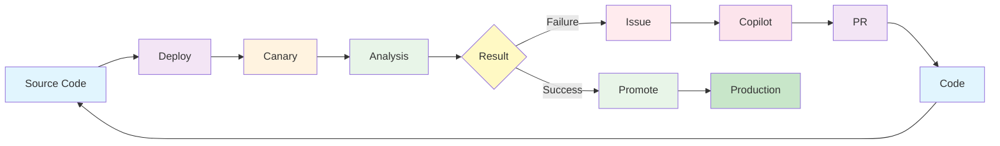
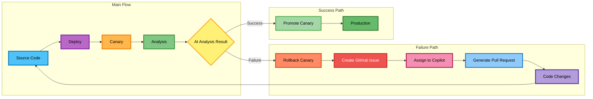
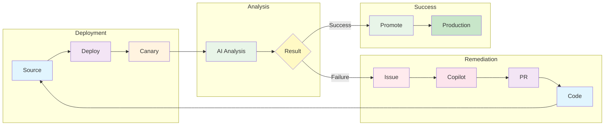
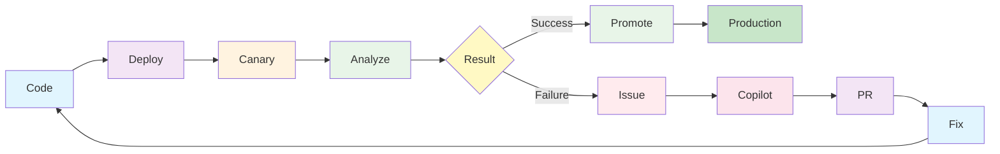
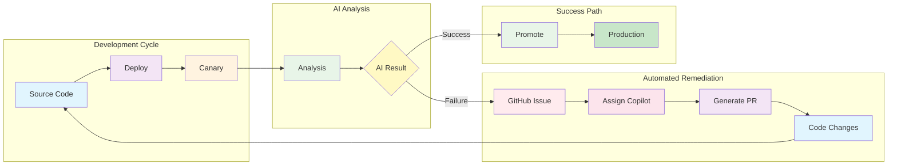

# Argo Rollouts AI Metric Plugin - Feedback Loop Diagram

## Option 1: Compact Horizontal Flow

## Option 2: Two-Row Layout (Modified)

## Option 3: Compact with Subgraphs

## Option 4: Minimalist Flow

## Option 5: Wide Format with Groups

## Feedback Loop Phases

1. **Source Code** - Initial codebase with application changes
2. **Deploy** - Deployment to Kubernetes cluster
3. **Canary** - Canary deployment with traffic splitting
4. **Analysis** - AI-powered analysis of canary vs stable behavior
5. **Failure** - AI detects issues in canary deployment
6. **Create GitHub Issue** - Automated issue creation with analysis details
7. **Assign to Copilot** - Issue assigned to GitHub Copilot for automated resolution
8. **Generate Pull Request** - Copilot creates PR with fixes
9. **Code Changes** - Developer reviews and merges the PR
10. **Back to Source Code** - Cycle continues with improved code

## Key Components

- **AI Analysis**: Uses Gemini AI to analyze logs and metrics
- **Automated Issue Creation**: Creates GitHub issues with detailed analysis
- **Copilot Integration**: Assigns issues to GitHub Copilot for automated fixes
- **Feedback Loop**: Continuous improvement through automated remediation
