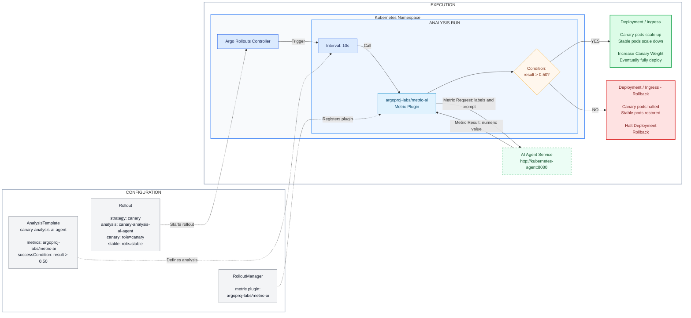

## Analysis

```mermaid
flowchart LR
  subgraph config [CONFIGURATION]
    direction TB
    at["AnalysisTemplate<br/>canary-analysis-ai-agent<br/><br/>metrics: argoproj-labs/metric-ai<br/>successCondition: result &gt; 0.50"]
    rollout["Rollout<br/><br/>strategy: canary<br/>analysis: canary-analysis-ai-agent<br/>canary: role=canary<br/>stable: role=stable"]
    manager["RolloutManager<br/><br/>metric plugin:<br/>argoproj-labs/metric-ai"]
    at ~~~ rollout
    rollout ~~~ manager
  end

  subgraph execution [EXECUTION]
    direction TB

    subgraph namespace [Kubernetes Namespace]
      direction TB
      controller["Argo Rollouts Controller"]

      subgraph analysis [ANALYSIS RUN]
        direction TB
        interval["Interval: 10s"]
        plugin["argoproj-labs/metric-ai<br/>Metric Plugin"]
        decision{"Condition:<br/>result &gt; 0.50?"}
        interval -->|Call| plugin
        plugin --> decision
      end

      controller -->|Trigger| interval
    end

    agent["AI Agent Service<br/>http://kubernetes-agent:8080"]

    plugin -->|"Metric Request: labels and prompt"| agent
    agent -->|"Metric Result: numeric value"| plugin

    success["Deployment / Ingress<br/><br/>Canary pods scale up<br/>Stable pods scale down<br/><br/>Increase Canary Weight<br/>Eventually fully deploy"]
    rollback["Deployment / Ingress - Rollback<br/><br/>Canary pods halted<br/>Stable pods restored<br/><br/>Halt Deployment<br/>Rollback"]

    decision -->|YES| success
    decision -->|NO| rollback
  end

  at -.->|Defines analysis| interval
  rollout -.->|Starts rollout| controller
  manager -.->|Registers plugin| plugin

  classDef configCard fill:#f3f4f6,stroke:#6b7280,color:#111827
  classDef blue fill:#dbeafe,stroke:#2563eb,color:#172554
  classDef metric fill:#e0f2fe,stroke:#0284c7,color:#0c4a6e
  classDef ai fill:#ecfdf5,stroke:#16a34a,color:#14532d,stroke-dasharray:5 5
  classDef choice fill:#fff7ed,stroke:#f59e0b,color:#7c2d12
  classDef good fill:#dcfce7,stroke:#16a34a,color:#14532d,stroke-width:2px
  classDef bad fill:#fee2e2,stroke:#dc2626,color:#7f1d1d,stroke-width:2px

  class at,rollout,manager configCard
  class controller,interval blue
  class plugin metric
  class agent ai
  class decision choice
  class success good
  class rollback bad

  style config fill:#ffffff,stroke:#94a3b8,stroke-width:2px
  style execution fill:#ffffff,stroke:#94a3b8,stroke-width:2px
  style namespace fill:#f8fafc,stroke:#3b82f6,stroke-width:2px
  style analysis fill:#eff6ff,stroke:#60a5fa,stroke-width:2px
```